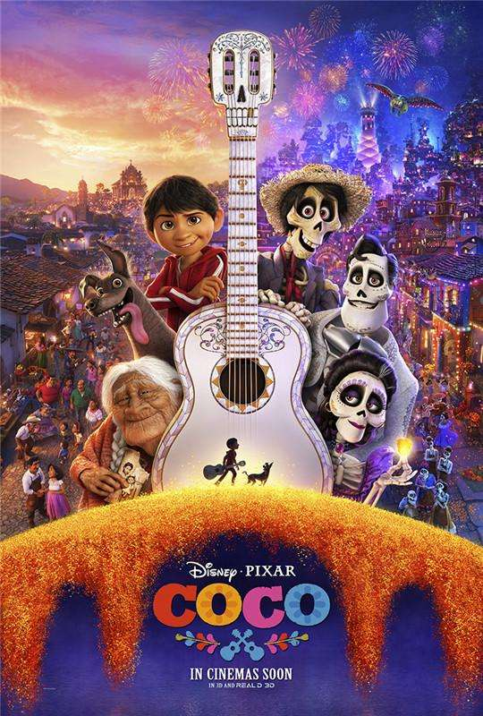
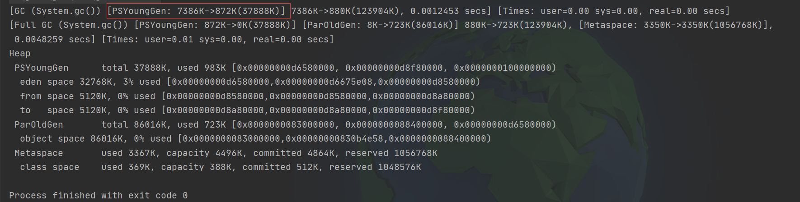
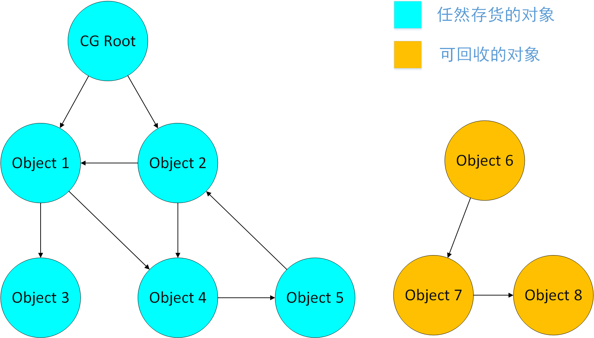

# 如何判断对象可以被回收？

<font color = orange>堆</font>里面存放着Java世界中几乎所有的<font color = #00BFFF>对象实例</font>，垃圾收集器对堆进行回收前，要做的第一件事情就是确定哪些对象还“活着”，哪些对象已经“死了”（即不可能再被任何途径使用）。

---



我觉得《寻梦环游记》是一个很棒的电影，让我对人类的死亡有了新的认识：每个人其实都要经历两次死亡——当灵魂和肉体分离，这是是第1次死亡；被所有人遗忘，这是第2次死亡，也是彻底的死亡。

---

## 引用计数算法（Reference Countint）

在很多教科书中都介绍了这样一种判别对象是否死亡的算法：为对象添加一个<font color = orange>引用计数器</font>，每当有一个地方引用了对象，计数器的数值+1；每当有一个引用失效，计数器的数值-1；任何时刻，引用计数器数值为0的对象就是不可能在被使用的对象。

客观地说，引用计数算法实现简单，判定效率也很高，大多数情况下它都是一个不错的算法，也有很多比较著名的应用案例，但是，**主流的JVM都没有选用引用计数算法来管理内存**，其中最主要的原因是它<font color = orange>很难解决对象之间相互循环引用的问题</font>。

> 下面的代码用于证明我现在使用的HotSpot虚拟机没有使用引用计数算法:
>
> ```java
> public class ReferenceCountingGC {
>  private static final int MB_1 = 1024 * 1024;
>  public Object instance = null;
> 
>  /**
>      * 这个成员属性的唯一意义就是占点内存，以便能在GC日志中看清楚是否被回收过。
>      */
>     private byte[] bigSize = new byte[2 * MB_1];
> 
>     /**
>      * 验证JVM是否使用“引用计数器”判断对象能否回收
>      */
>     public static void testGC() {
>         ReferenceCountingGC instanceA = new ReferenceCountingGC();
>         ReferenceCountingGC instanceB = new ReferenceCountingGC();
>         instanceA.instance = instanceB;
>         instanceB.instance = instanceA;
> 
>         instanceA = null;
>         instanceB = null;
> 
>         // 假设在这里发生GC，instanceA和instanceB是否能被回收？
>         System.gc();
>         /*
>          * 若JVM采用“引用计数器”判断对象能否回收，由于instanceA和instanceB相互引用，
>          * instanceA和instanceB的“被引用数”都不为0，因此，都不能被回收。
>          */
>     }
> 
>     public static void main(String[] args) {
>         ReferenceCountingGC.testGC();
>     }
> }
> ```
> 设置虚拟机参数 -XX:+PrintGCDetails ，执行代码，控制台打印信息如下：
>
> 

---

## 可达性分析算法（Reachability Analysis）

在主流的商用程序语言（Java、C#等）的主流实现中，都是通过<font color = orange>可达性分析</font>来判定对象是否死亡。可达性分析算法的基本思路是：以一系列被称为<font color = #00BFFF>“GC Roots”</font>的对象为起点，寻找到达某个对象的路径，该路径被称为<font color = #00BFF>“引用链”</font>，若引用链不存在，则认为此对象是不可用的。



在Java语言中，可作为GC Roots 的对象包括下面几种：

1. 虚拟机栈（栈帧中的<font color = 22B14C>本地变量表</font>）中引用的对象。
2. 方法区中<font color = 22B14C>类静态属性</font>引用的对象。
3. 方法区中<font color = 22B14C>常量</font>引用的对象。
4. 本地方法栈中JNI（即一般说的<font color = 22B14C>Native方法</font>）引用的对象。

---

参考文献：

1. 《深入理解Java虚拟机》

