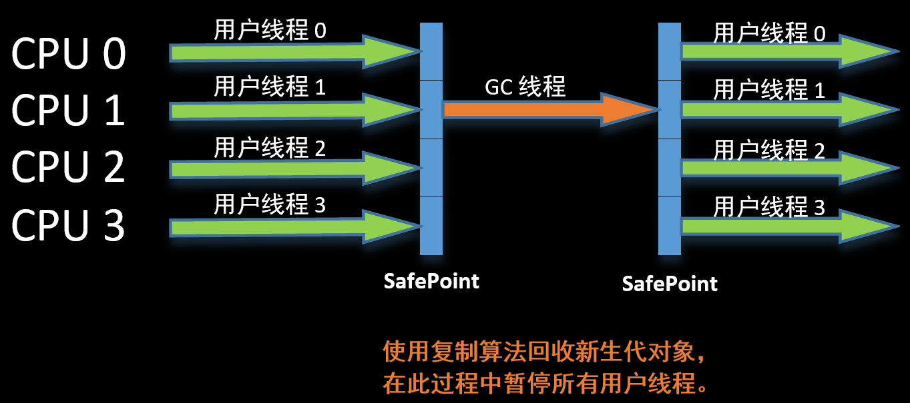

# Serial垃圾收集器

---

Serial是最基础、发展历史最悠久的收集器。

> Serial：依次的

Serial是一个单线程收集器。这里“单线程”的含义不仅仅说明它只会使用一个CPU或一条收集线程去完成垃圾收集工作，更重要的是，Serial进行垃圾收集的时候，必须暂停其他所有的工作线程，直到它收集结束。

从JDK1.3开始，HotSpot虚拟机开发团队一直在努力消除因为内存回收而导致的用户线程停顿的时间。从Serial收集器到Parallel收集器，再到Concurrent Mark Sweep，乃至G1收集器的出现，用户线程的停顿时间越来越短，但依旧无法消除。

到目前为止，Serial收集器依然是HotSpot虚拟机在Client模式下的默认新生代收集器。在单CPU环境下，Serial收集器由于没有线程交互的开销，可以专心地进行垃圾收集，因此具有最高的单线程垃圾收集效率。

在用户端的桌面应用场景下，新生代并不会很大，停顿时间并不会很长，只要GC不过于频繁，停顿时间是可以接收，所以，Serial收集器对于运行在Client模式下的虚拟机来说是一个很好的选择。

---

《深入理解Java虚拟机》学习笔记