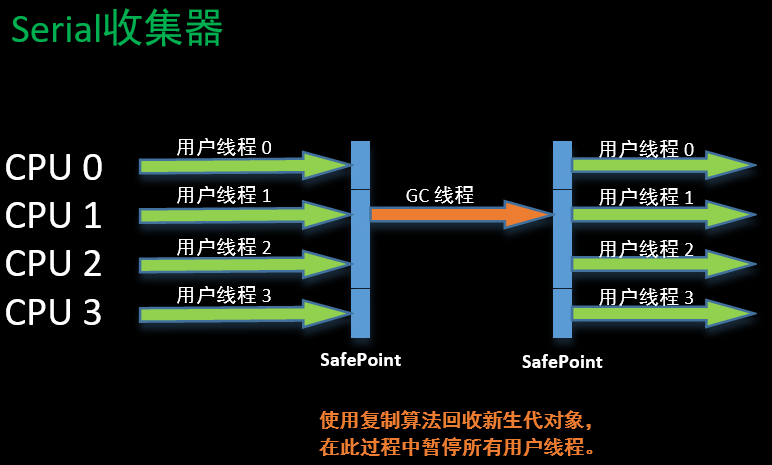
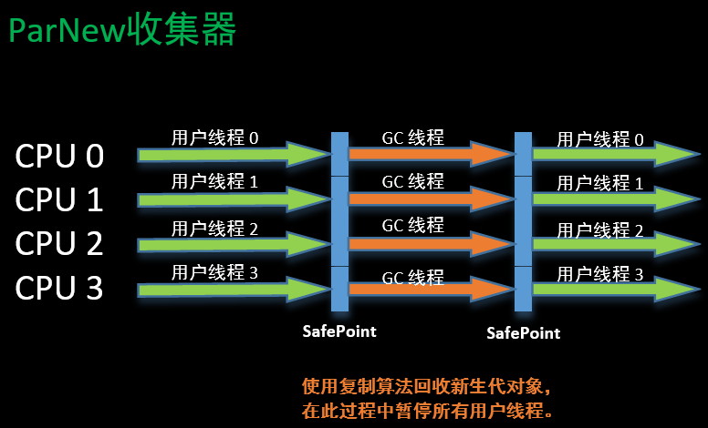

# ParNew收集器

---

ParNew收集器其实就是Serial收集器的多线程版本——使用多条线程进行垃圾收集。

> Parallel：平行的，并列的

Serial收集器于ParNew收集器工作过程对比：

于Serial收集器相比，ParNew收集器除了多线程垃圾收集之外，并没有太多创新之处，但它确实许多运行在Service模式下的虚拟机首选的新生代收集器，一个与性能无关的但很重要的原因是，除了Serial收集器之外，目前只有ParNew收集器可以与CMS收集器配置使用。

---

《深入理解Java虚拟机》学习笔记