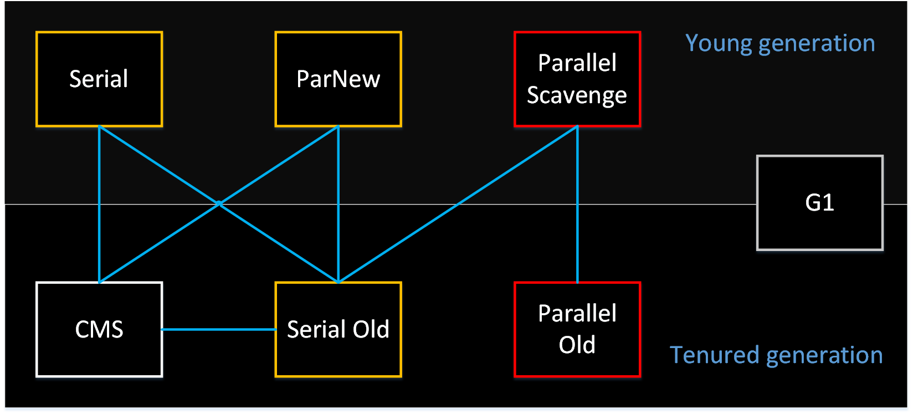

# Parallel Old收集器

---

Parallel Old是Parallel Scavenge的老年代版本，使用多线程和“标记 - 整理”算法。

Parallel Old收集器在JDK1.6之后才开始提供，在此之前，Parallel Scavenge收集器的地位十分尴尬。Parallel Scavenge收集器常被称为“吞吐量优先收集器”，确实，与其他收集器关注于减少用户线程停顿时间不同，Parallel Scavenge收集器专注于提升吞吐量，因此Parallel Scavenge收集器常被用于服务端。

$$
 吞吐量 = 用户线程执行时间 / (用户线程执行时间 + 垃圾收集时间)
$$
在Parallel Old收集器推出之前，可以与Parallel Scavenge收集器一起配合工作的老年代收集器只有Serial Old。由于Serial Old收集器在服务端应用性能上的“拖累”（单线程的老年代收集器无法充分利用服务器多CPU的处理能力），使用Parallel Scavenge收集器未必能在整体应用上获得吞吐量最大化的效果。

Parallel Old收集器出现后，Parallel Scavenge收集器才真正的有了名副其实的“高吞吐量”组合。

在注重吞吐量以及CPU利用率的应用情景，可以优先考虑Parallel Scavenge 和 Pallel Old的组合。