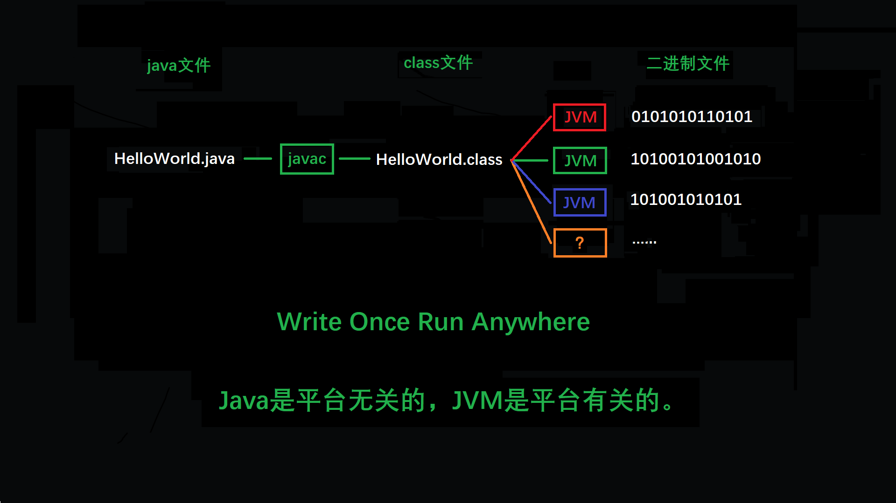

# 无关性的基石

---

## 平台无关性

“Write Once, Run Anywhere” 是Java诞生之初便提出的口号，这句话充分表达了开发人员对冲破平台界限的渴望。“与平台无关”的理想最终实现在操作系统的应用层上：虚拟机提供商提供了许多可以运行在各种不同平台上虚拟机，这些虚拟机都可以载入和执行同一种平台无关的字节码，从而实现了程序的“一次编写，处处执行”。

运行在各种平台的虚拟机以及平台无关的字节码是构成Java平台无关性的基石。

## 语言无关性

Java虚拟机并不是Java的伴生产物，事实上JVM并不关心字节码文件来源于何种语言。