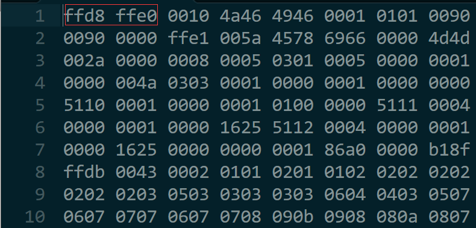

# 魔数

---

1. HelloWorld.java

```java
package com.xiao.virtual;
public class HelloWorld{
	public static void main(String[] args){
		int i = 10;
		while(i > 0){
			System.out.println("Hello World!");
			i--;
		}
	}
}
```

2. HelloWorld.class

```
cafe babe 0000 0034 001e 0a00 0600 1009
0011 0012 0800 130a 0014 0015 0700 1607
0017 0100 063c 696e 6974 3e01 0003 2829
5601 0004 436f 6465 0100 0f4c 696e 654e
756d 6265 7254 6162 6c65 0100 046d 6169
6e01 0016 285b 4c6a 6176 612f 6c61 6e67
2f53 7472 696e 673b 2956 0100 0d53 7461
636b 4d61 7054 6162 6c65 0100 0a53 6f75
7263 6546 696c 6501 000f 4865 6c6c 6f57
6f72 6c64 2e6a 6176 610c 0007 0008 0700
180c 0019 001a 0100 0c48 656c 6c6f 2057
6f72 6c64 2107 001b 0c00 1c00 1d01 001b
636f 6d2f 7869 616f 2f76 6972 7475 616c
2f48 656c 6c6f 576f 726c 6401 0010 6a61
7661 2f6c 616e 672f 4f62 6a65 6374 0100
106a 6176 612f 6c61 6e67 2f53 7973 7465
6d01 0003 6f75 7401 0015 4c6a 6176 612f
696f 2f50 7269 6e74 5374 7265 616d 3b01
0013 6a61 7661 2f69 6f2f 5072 696e 7453
7472 6561 6d01 0007 7072 696e 746c 6e01
0015 284c 6a61 7661 2f6c 616e 672f 5374
7269 6e67 3b29 5600 2100 0500 0600 0000
0000 0200 0100 0700 0800 0100 0900 0000
1d00 0100 0100 0000 052a b700 01b1 0000
0001 000a 0000 0006 0001 0000 0002 0009
000b 000c 0001 0009 0000 004b 0002 0002
0000 0016 100a 3c1b 9e00 11b2 0002 1203
b600 0484 01ff a7ff f1b1 0000 0002 000a
0000 0016 0005 0000 0004 0003 0005 0007
0006 000f 0007 0015 0009 000d 0000 0007
0002 fc00 0301 1100 0100 0e00 0000 0200
0f
```

如上所示，以十六进制打开由HelloWorld.java文件编译生成的字节码文件（HelloWorld.class文件），发现在文件前4字节的位置，有一段内容为“cafebabe”的魔数。

---

## 为什么需要在文件内容中添加魔数？

事实上，除了字节码文件，还有很多其他类型的文件也存在魔数，例如jpg、gif。

在大多数情况下，我们可以通过扩展名来判断一个文件的类型，这种方式比较简单，但是可能不太准确，因为文件的扩展名很容易被修改。在许多情况下，有必要准确的识别文件的类型，为此就有了“魔数”。

很多类型的文件，其起始的几个字节的内容是固定的（或是有意填充，或者本就如此）这几个字节的内容就是所谓的“魔数”。

---

1. HelloWorld.jpg


2. 修改文件扩展名，以16进制打开文件：



OxFFD8FFE0就知jpg文件的魔数。