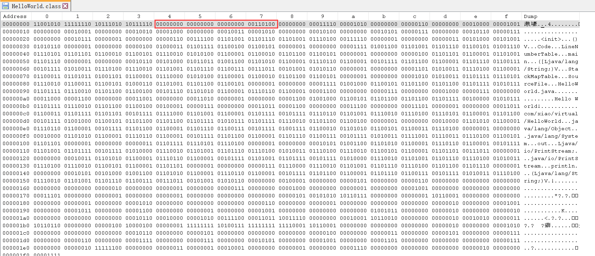

# Class文件版本号
---

表1 Class文件格式

| 类型           | 名称                                      | 数量                    |
| -------------- | ----------------------------------------- | ----------------------- |
| u4             | magic                                     | 1                       |
| u2             | minor_version | 1                       |
| u2             | major_version | 1                       |
| u2             | constant_pool_count                       | 1                       |
| cp_info        | constant_pool                             | constant_pool_count - 1 |
| u2             | access_flags                              | 1                       |
| u2             | this_class                                | 1                       |
| u2             | super_class                               | 1                       |
| u2             | interfaces_count                          | 1                       |
| u2             | interfaces                                | interfaces_count        |
| u2             | fields_count                              | 1                       |
| field_info     | fields                                    | fields_count            |
| u2             | methods_count                             | 1                       |
| method_info    | methods                                   | methods_count           |
| u2             | attributes_count                          | 1                       |
| attribute_info | attributes                                | attributes_count        |

如Class文件表结构所示，Class文件的版本号信息排列在魔数之后：第5、6字节为次版本号，第7、8字节为主版本号。

Java的版本号是从45开始的，JDK1.1之后的每个大版本的主版本号向上加1（JDK1.0 ~ 1.1使用45.0 ~ 45.3）。

高版本的JDK能够向下兼容更低版本的Class文件，但不能运行更高版本的Class文件，即使文件格式格式并未发生任何变化，虚拟机也必须拒绝执行超过其版本号的Class文件。

---

1. 以十六进制打开HelloWorld.class 文件

2.  以二进制打开HelloWorld.class文件

上图表明，次版本号为0，主版本号为52，说明本文件可以被JDK1.8或以上版本的虚拟机执行。

