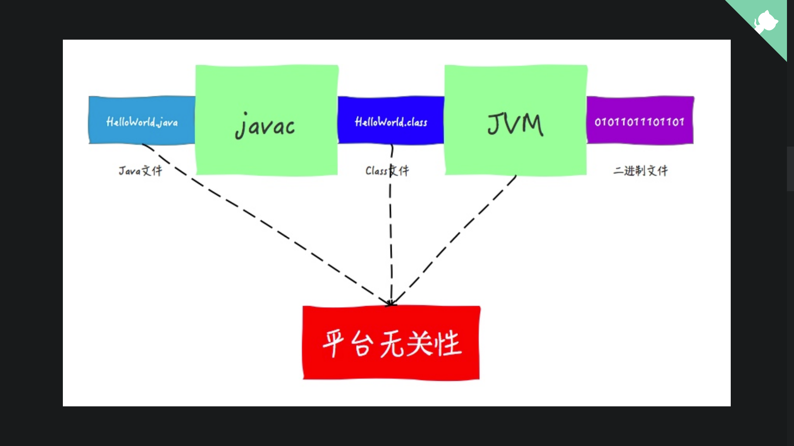

# 虚拟机类加载机制概述

“代码编译的结果从本地机器码转变为字节码，是存储格式发展的一小步，却是编程语言发展的一大步。”

---

## 什么是虚拟机的类加载机制？

Class文件中存储的各种关于类的描述信息，<u>需要加载到虚拟机中才能运行和使用</u>。

> 这里所说的“Class文件”指的是一串二进制的字节流，并不仅仅指.class文件这一种存在形式。

虚拟机把描述类的信息从Class文件加载到内存，并对数据进行校验、解析转换、初始化，最终形成可以被虚拟机直接使用的Java类型，这就是虚拟机的**类加载机制**。

---

与那些在编译时需要进行连接工作的语言不同，在Java语言里面，类型的加载、连接和初始化过程都是在程序运行期间完成的，这种策略虽然会导致类加载时需要增加一下额外的性能开销，但是也为Java应用程序带来了高度的的灵活性。

Java语言与生俱来的支持动态拓展的语言特性，就是依赖运行期动态加载和动态连接这个特点实现的。

---

《深入理解Java虚拟机》学习笔记

