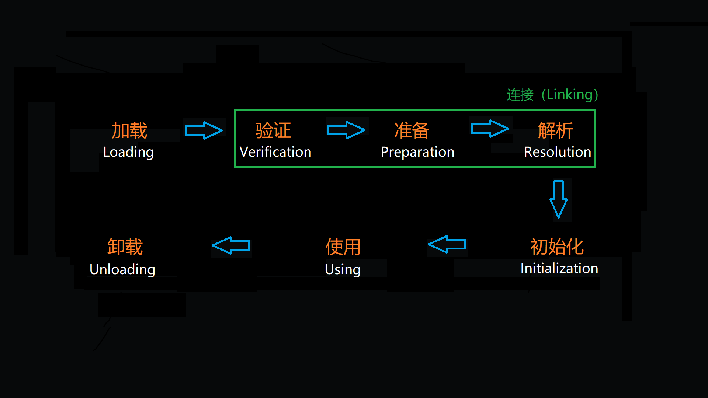

# 类加载的时机

---

## 类的生命周期

类从被加载到虚拟机内存开始，到卸载出内存位置，它的整个生命周期包含7个阶段：加载（Loading）、验证（Verification）、准备（Preparation）、解析（Resolution）、初始化（Initialization）、使用（Using）、卸载（Unloading）。其中，验证、准备、解析3个阶段统称为连接。

加载、验证、准备、初始化、卸载这5个阶段的顺序时确定的，在类的加载过程中，这5个阶段必须按照顺序开始，而**解析阶段**则不一定，在某些情况下，解析阶段可以在初始化阶段之后开始，这是为了支持Java语言的**运行时绑定**（也称动态绑定或晚期绑定）。

> 上面特别强调了“开始”，而不是“进行”或“完成”，这是因为各阶段通常都是交叉地混合式进行的，通常会在一个阶段执行的过程中调用、激活另一个阶段。

---

## 类的加载时机

关于何时开始类记载过程的第一个阶段：加载，Java虚拟机规范中并没有进行强制约束，这交给具体的虚拟机实现进行把握。但虚拟机规范严格规定了**有且只有**5种情况必须立即对类进行**“初始化”**（而加载、验证、准备需要在此之前开始）。

1. 遇到new、getstatic、putstatic或者invokestatic这4条字节码指令时，如果类尚未进行初始化，则需要开始类的初始化。

> new：创建类实例的字节码指令；
>
> getstatic、putstatic：访问类属性（static属性）的指令；
>
> invokestatic：调用类方法（static方法）的指令

生成这4条指令的常见代码场景是：使用new关键字创建类的实例、访问类的静态属性（<u>被final修饰、已经在编译期把结果放入常量池的静态属性**除外**</u>）、调用类的静态方法。

2. 使用java.lang.reflect包的方法对类进行反射调用时，如果类尚未进行初始化，则需要开始类的初始化。
3. 初始化一个类时，若其父类尚未进行初始化，则需要先触发其父类的初始化。
4. 虚拟机启动时，用户需要指定一个要执行的主类（包含main()方法的那个类），虚拟机会先初始化这个类。
5. 当使用JDK1.7的动态语言支持时，如果一个java.lang.invoke.MethodHandle实例最后解析结果REF_getStatic、REF_putStatic、REF_invokeStatic的方法句柄，并且这个方法句柄对应的类尚未进行初始化，则需要先触发其初始化。

---

## 主动引用、被动引用

