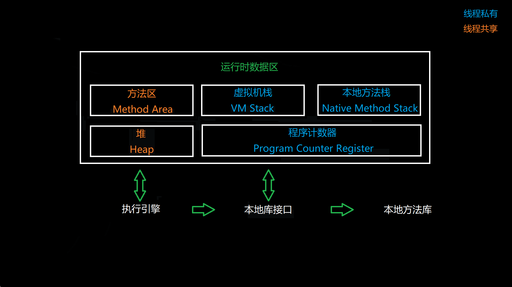

# 局部变量表

---

## 1. 局部变量表的存储位置

局部变量表存储于栈帧，栈帧存储于虚拟机栈。

> 虚拟机栈是线程私有的，每一个方法的开始调用和执行结束，分别对应着一个栈帧在虚拟机栈中入栈和出栈的过程。
>
> 栈帧中存储的数据大致有：局部变量表、操作数栈、动态连接、方法返回地址

图1 虚拟机运行时数据区域

图2 栈帧的结构

## 2. 局部变量表的说明

**局部变量表（Local Variable Table）是一组变量值存储空间，用于存储【方法参数】以及方法内定义的【局部变量】。**

程序一经编译，每个方法的局部变量表所需的最大容量便已经确认。

局部变量表的容量以【变量槽（Variable Slot）】为最小单位，虚拟机规范中并没有明确指明一个Slot应该占用多大的内存空间，只是很有导向性的说到，每个Slot都应该能够存放一个boolean、byte、char、short、int、float、reference或returnAddress类型的数据。

为了尽可能节省内存空间，局部变量表中的Slot是可以重用的，方法体中定义的局部变量，其作用范围不一定会覆盖整个方法体，如果当前PC计数器的值已经超出了某个变量的作用域，那么这个变量的Slot就可以交给其他变量使用。

---

《深入理解JVM》学习笔记

