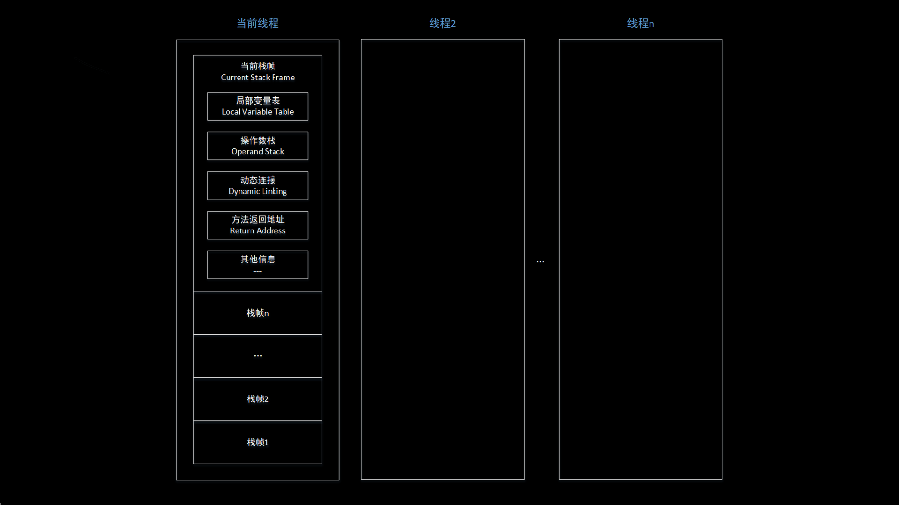

# 操作数栈

---

## 1. 操作数栈所处的位置

虚拟机运行时内存区域 / 虚拟机栈 / 栈帧 / 操作数栈

## 2. 操作数栈的简单说明

操作数栈（Operand Stack）常被称为操作栈，同局部变量表一样，操作数栈的最大深度在编译时就已经确定。

当一个方法刚开始执行的时候，这个方法的操作数栈的空的，在方法的执行过程中，会有各种字节码指令往操作数栈中写入和读取数据，即入栈、出栈操作。举个例子，整数加法的字节码指令iadd在执行的时候，会先取出操作数栈栈顶的两个元素，然后将二者相加的结果再次压入操作数栈。

操作数栈可以存储任意Java数据类型的数据，因此操作数栈中元素的数据类型必须与字节码指令序列严格匹配。