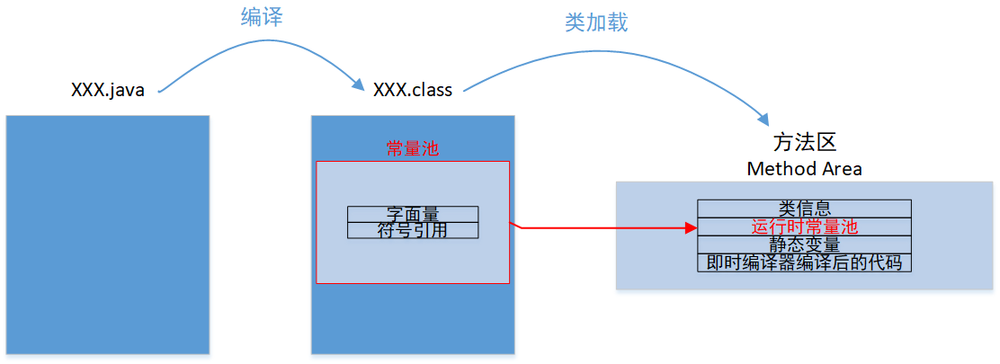

# 字符串 & 堆 & 方法区

## 1. 问题引入

```java
package com.learn.java;

/**
 * @author xzy
 * @date 2020-09-17 22:33
 * 说明：字符串 & 堆 & 方法区
 */
public class Main {
    public static String s = "HELLO WORLD!";

    public static void main(String[] args) {
        String s1 = "HELLO WORLD!";
        String s2 = "HELLO WORLD!";
        String s3 = new String("HELLO WORLD!");

        System.out.println(s1 == s); // true
        System.out.println(s2 == s); // true
        System.out.println(s1 == s2);// true
        System.out.println(s3 == s); // false
        System.out.println(s3 == s1);// false
        System.out.println(s3 == s2);// false
    }
}
```

## 2.问题分析


<center>图2.1 Java 虚拟机运行时数据区</center>

### 2.1 字符串 & 方法区

class 文件中有一块被称作<font color = red>“常量池”</font>的区域，常量池可以被视为 class 文件的资源仓库，常量池中主要存放两大类常量：

- 字面量：**字符串**、final常量……
- 符号引用：类/接口的全限定名、字段/方法的名称、字段/方法的描述符

在方法区有一块被称作<font color = red>“运行时常量池”</font>的区域，当类被加载进 java 虚拟机的内存空间，class 文件常量池中的内容会被加载到运行时常量池。



<center>图2.2字面量进入方法区的过程</center>

使用 <u>javap -v Main.class</u> 命令查看程序编译后产生的字节码：


<center>图2.3 常量池信息</center>

### 2.2 字符串 & 堆

<font color = red>堆</font>是 java 虚拟机所管理的内存中最大的一块，此内存区域的唯一作用是存放**对象实例**和数组。

### 2.3 总结


s、s1、s2指向方法区中值为 “Hello WORLD!” 的 String 实例（类加载时创建），s3指向堆中值为 “Hello WORLD!” 的 String 实例（程序运行时创建），== 比较的是两个引用指向的对象是否相同。