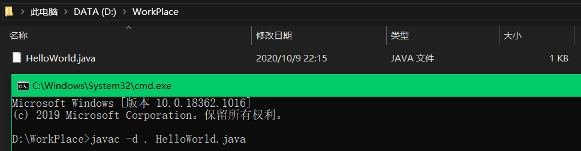
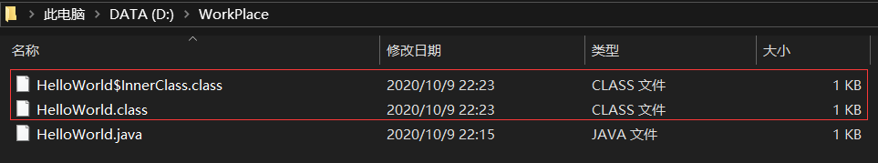

# Java：内部类与字节码文件

1. 编写Java类

    HelloWorld.java

    ```java
    public class HelloWorld{
        
        public static void main(String[] args){
            System.out.println("Hello World!");        
        }
    
        public class InnerClass{
            
        }
    }
    ```

2. 编译Java类

    javac -d . HelloWorld.java

    

3. 编译结果

    

4. 总结

    1. javac 命令格式

        javac  [ -d  编译生成的字节码文件的存放位置 ]  Java源文件所在的位置

    2. 编译 C 程序时，不仅需要指定存放目标文件的位置，还需要指定目标文件的名称，而编译 Java 程序时，只需要指定存放目标文件的位置即可，因为 javac 编译后生成的字节码文件具有默认的文件名：文件名总是以源文件所定义的类的类名为文件名，以 .class 为后缀名。这意味着如果一个源文件内如果定义了多个类，编译后将生成多个字节码文件。
    
    3. 内部类是一种编译期现象，JVM 对此一无所知，换而言之：JVM 眼里没有内部类、外部类。


