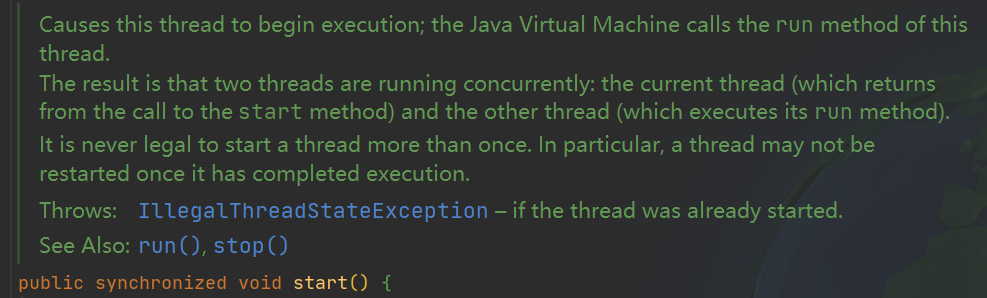
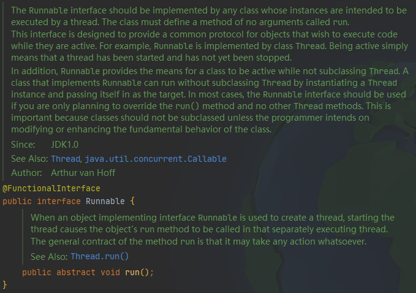

# Java线程的简单使用

---

```java
public class Main {
    public static void main(String[] args) {
        //1.
        Runnable runnable = new Runnable() {
            @Override
            public void run() {
                System.out.println("hello world!");
            }
        };
        //2.
        Thread thread = new Thread(runnable);
        //3.
        thread.start();
    }
}
```

> 也可以通过创建一个Thread类的子类来定义一个线程，如：
>
> ```java
> class SayHelloThread extends Thread{
>  @Override
>  public void run(){
>      System.out.println("hello world!");
>  }
>  
>   public static void main(String[] args) {
>      SayHelloThread sayHelloThread = new SayHelloThread();
>      sayHelloThread.start();
>  }
> }
> ```

上面方法现在已经不再推荐了，<font color = yellow>并行任务不应该与运行机制耦合。</font>如果有很多任务要执行，采用上面的方式将为每一个任务创建一个线程，线程的创建和销毁需要消耗大量系统资源。使用使用线程池来解决这个问题。

<font color = red>警告：</font>不要直接调用Thread类或Runnable对象的run方法。直接调用run方法，只会执行同一个线程中的任务，并不会启动新线程。应该调用Thread.start方法，该方法将创建一个执行run方法的新线程。



## Runnable接口



Runnable是一个函数接口，所以可以使用lambda表达式创建一个实例：

```java
public class Main {
    public static void main(String[] args) {
        //1.
        Runnable runnable = () -> {
            System.out.println("hello world!");
        };
        //2.
        Thread thread = new Thread(runnable);
        //3.
        thread.start();
    }
}
```