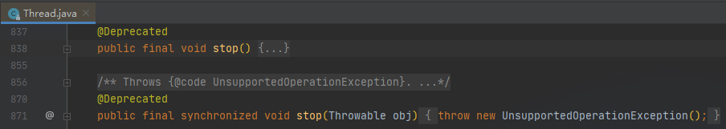

# 线程中断

---

在Java的早期版本中，通过调用Thread类的stop方法，可以终止一个线程。但是，这个方法现在已经被弃用了。



目前，没有可以<font color = yellow>强制线程终止</font>的方法，一般通过**interrupt()**方法来<font color = green>请求线程终止</font>。下面简单看一下interrupt()方法的源码：

```java
class Thread implements Runnable{
    public void interrupt(){
        //[1]
        if (this != Thread.currentThread())
            checkAccess();
        synchronized (blockerLock) {
            Interruptible b = blocker;
            if (b != null) {
                interrupt0();           // Just to set the interrupt flag
                b.interrupt(this);
                return;
            }
        }
        interrupt0();
    }
}
```

```
注释：
Interrupts this thread.

[1] Unless the current thread is interrupting itself, which is always permitted, the checkAccess method of this thread is invoked, which may cause a SecurityException to be thrown.

If this thread is blocked in an invocation of the wait(), wait(long), or wait(long, int) methods of the Object class, or of the join(), join(long), join(long, int), sleep(long), or sleep(long, int), methods of this class, then its interrupt status will be cleared and it will receive an InterruptedException.

If this thread is blocked in an I/O operation upon an InterruptibleChannel then the channel will be closed, the thread's interrupt status will be set, and the thread will receive a ClosedByInterruptException.

If this thread is blocked in a Selector then the thread's interrupt status will be set and it will return immediately from the selection operation, possibly with a non-zero value, just as if the selector's wakeup method were invoked.

If none of the previous conditions hold then this thread's interrupt status will be set.(如果以上条件均不成立，则设置该线程的中断状态)

Interrupting a thread that is not alive need not have any effect.（中断非活动的线程不会产生任何效果）

Throws: SecurityException - if the current thread cannot modify this thread
```

调用一个线程的interrupt方法，其实是为了将该线程的<font color = yellow>中断状态</font>置位。中断状态是每一个线程都具有的boolean标志。每一个线程应该时常检查这个标志，以判断自己受否接收到中断请求。

```java
while(!Thread.currentThread().isInterrupted()){
    ......
}
```

如果试图对一个处于被阻塞状态的线程调用interrupt()方法，将会抛出InterruptedException，被阻塞的线程无法检查中断标志。

**没有任何语言方法的需求要求一个被中断的线程应该终止，线程接收到中断请求后，可以决定如何响应中断。**

> 如果在每次工作迭之后都调用<font color = yellow>sleep()</font>方法（或者其他可中断方法），isInterrupted方法将无法发挥作用。在中断状态被置位的情况下调用sleep方法，并不能达到使线程休眠的目的，**线程的中断状态会被清除**，同时抛出InterruptedException异常。因此，如果你的循环调用 sleep方法，线程并不检测中断状态，而且，你还需要做好捕获异常的准备。

---

参考资料：

1. 《Java核心技术 卷Ⅰ》