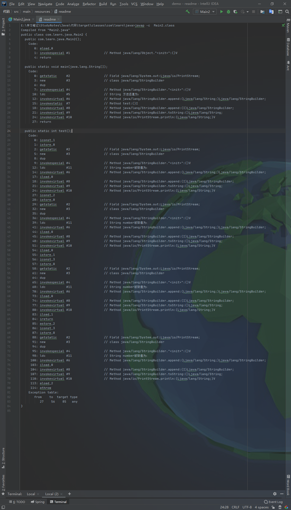
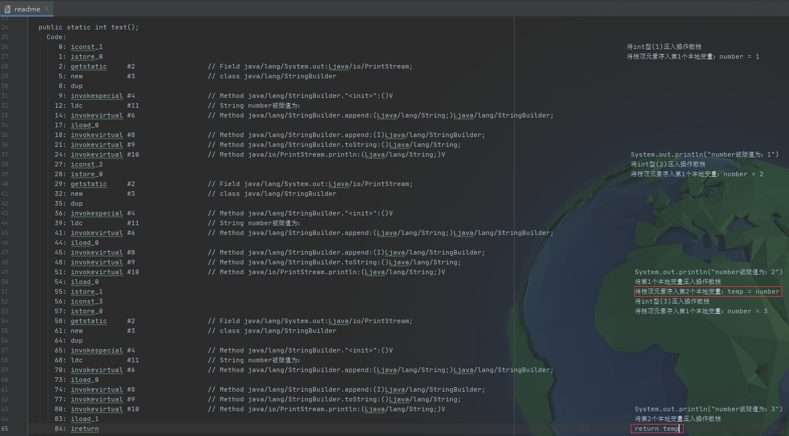
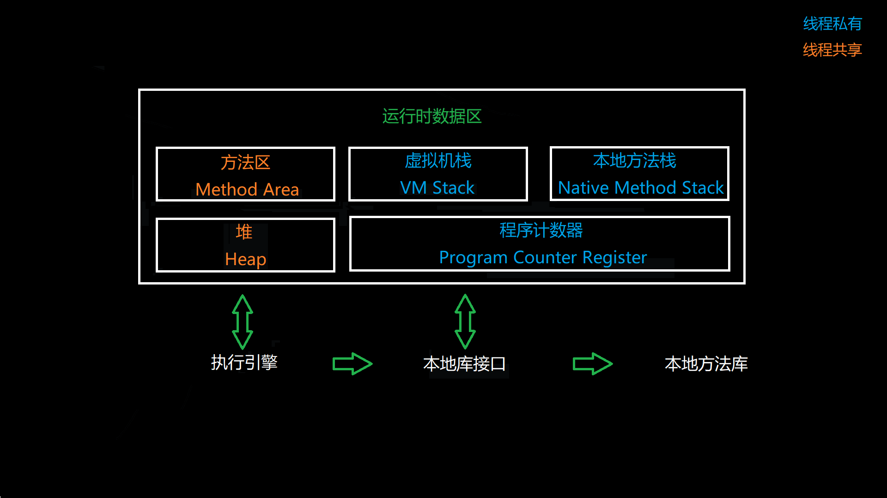
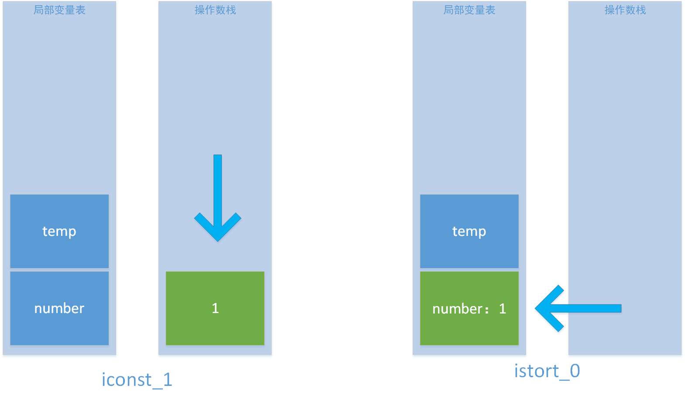
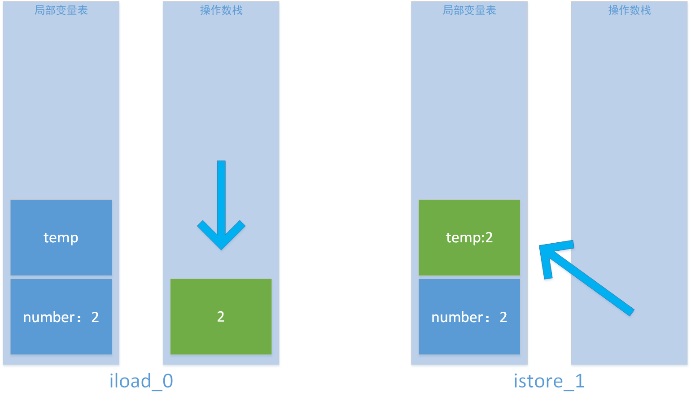
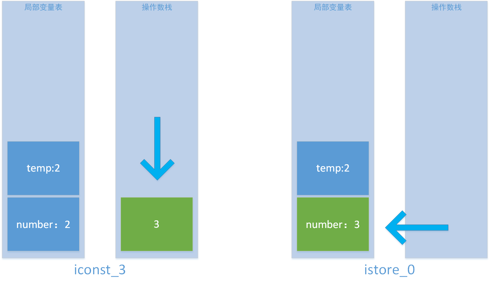
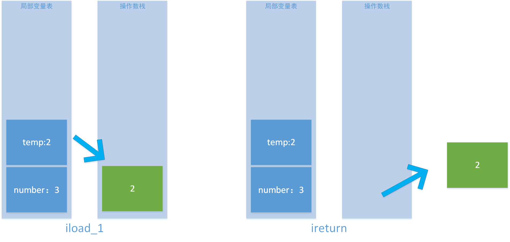
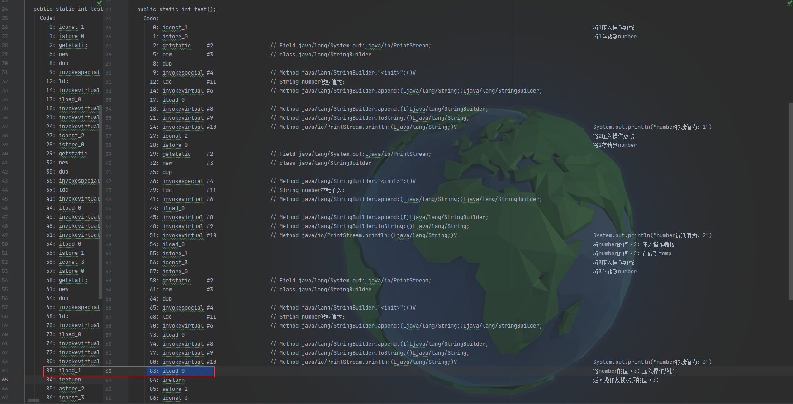

# finally 与 return

---

## **代码1**

```java
public class Main2 {
    public static void main(String[] args) {
        System.out.println("方法返值为：" + Main2.test());
    }

    public static int test() {
        int number = 1;
        System.out.println("number被赋值为：" + number);
        try {
            number = 2;
            System.out.println("number被赋值为：" + number);
            return number;
        } finally {
            number = 3;
            System.out.println("number被赋值为：" + number);
       }
    }
}
```

​    **执行结果：**

```
number被赋值为：1
number被赋值为：2
number被赋值为：3
方法返值为：2
```

​    **观察现象：**

1. finally代码块中的语句在return语句之前执行；
2. 虽然“number = 3” 在 “return number“之前执行，但return语句最终返回的数值是2；

​    **探寻本质：**

1. 使用”javap -c Main2.class”命令反编译字节码文件。



2. 查看虚拟机指令序列



从执行序列可以看出：

​    1、在执行return语句之前，finally代码块中的语句会先被执行；

​    2、执行“number = 3”这条赋值语句之前，number原有的值被存储到变量temp；

​    3、return语句将temp变量存储的数值返回。

Java运行时区域包括：



虚拟机栈描述的是Java方法执行的内存模型：每个方法在执行的同时，都会创建一个栈帧用于存储局部变量表、操作数栈、动态链接、方法出口等信息。每一个方法从开始调用到执行完成的过程，就对应着一个栈帧在虚拟机栈中入栈和出栈的出栈的过程：










##  **代码2**

对代码1进行简单修改：

```java
public class Main2 {
    public static void main(String[] args) {
        System.out.println("方法返值为：" + Main2.test());
    }

    public static int test() {
        int number = 1;
        System.out.println("number被赋值为：" + number);
        try {
            number = 2;
            System.out.println("number被赋值为：" + number);
            return number;
        } finally {
            number = 3;
            System.out.println("number被赋值为：" + number);
            // 在finally代码块新增return语句
            return number;
        }
    }
}
```

​    **代码执行结果：**

```
number被赋值为：1
number被赋值为：2
number被赋值为：3
方法返值为：3
```

​    **反编译代码：**



比较代码1和代码2的指令序列，可以发现代码1最终返回的是temp存储的值（2），代码2最终返回的是number的值（3）。