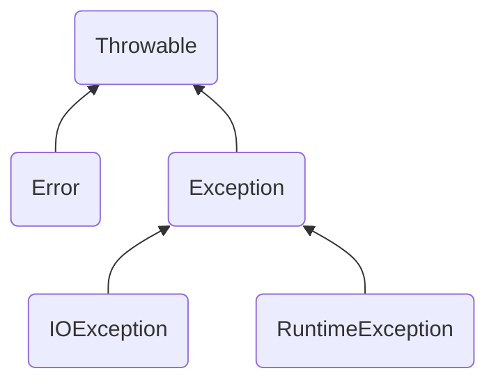

# 受查异常 & 非受查异常

## 1. Java 异常层次结构图

- **Error**

    系统内部错误 or 资源耗尽错误。任何程序代码都具有抛出这些异常的可能。

- **RuntimeException**

    由程序错误导致的异常，例如，数组访问越界、访问 null 指针。“如果出现 RuntimeException 异常，那么就一定是你的问题”，RuntimeException 异常完全在开发人员的掌控之下。

- **IOException**

    不是由程序错误导致的其他异常，例如，试图打开的文件不存在。

## 1.2 受查？非受查？

- **非受查异常**

    Java 语言规范将派生于 Error 类或 RuntimeException 类的所有异常称为非受查（unchecked）异常。编译器不会检查是否为非受查异常提供了异常处理器，毕竟，<u>应该精心的编写代码来避免这些错误的发生，而不要将精力花在编写异常处理器上。</u>

- **受查异常**

    <u>Java语言规范将派生于 IOException 类的所有异常称为受查（checked）异常。</u>编译器将检查是否为所有受查异常提供了异常处理器。

