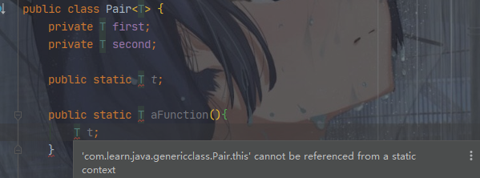

# Java泛型的约束与局限性

​    使用Java泛型时需要考虑一些限制，大部分限制是由**类型擦除**引起的。

---

##  类型擦除

<u>虚拟机中没有泛型类型对象，所有对象都属于普通类</u>。无论何时定义一个泛型类型，都自动提供了一个相应的**原始类型**（raw type）。

原始类型的创建：以删去类型参数后的泛型类型名作为原始类型的名字，<u>擦除类型变量，并以第一个限定类型替换，若没有限定类型则以Object替换</u>。

```java
public class TreeNode<T extends Type1 & Type2 & Type3> {
    private T value = null;
    private TreeNode<T> leftChild = null;
    private TreeNode<T> rightChild = null;

    public TreeNode() {
    }

    public TreeNode(T value, TreeNode<T> leftChild, TreeNode<T> rightChild) {
        this.value = value;
        this.leftChild = leftChild;
        this.rightChild = rightChild;
    }

    public T getValue() {
        return value;
    }

    public void setValue(T value) {
        this.value = value;
    }

    public TreeNode<T> getLeftChild() {
        return leftChild;
    }

    public void setLeftChild(TreeNode<T> leftChild) {
        this.leftChild = leftChild;
    }

    public TreeNode<T> getRightChild() {
        return rightChild;
    }

    public void setRightChild(TreeNode<T> rightChild) {
        this.rightChild = rightChild;
    }
}
```

原始类型：（若没有限定类型，类型参数用Object替代）

```java
public class TreeNode {
    private Type1 value = null;
    private TreeNode leftChild = null;
    private TreeNode rightChild = null;

    public TreeNode() {
    }

    public TreeNode(Type1 value, TreeNode leftChild, TreeNode rightChild) {
        this.value = value;
        this.leftChild = leftChild;
        this.rightChild = rightChild;
    }

    public Type1 getValue() {
        return value;
    }

    public void setValue(Type1 value) {
        this.value = value;
    }

    public TreeNode getLeftChild() {
        return leftChild;
    }

    public void setLeftChild(TreeNode leftChild) {
        this.leftChild = leftChild;
    }

    public TreeNode getRightChild() {
        return rightChild;
    }

    public void setRightChild(TreeNode rightChild) {
        this.rightChild = rightChild;
    }
}
```

在程序中可以包含许多不同类型的TreeNode，例如TreeNode<Type1>或TreeNode<Type2>，但是类型擦除后都变成TreeNode原始类型。

---

## 1. 不能使用基本类型实例化类型参数

```java
public static void main(String[] args) {
    List<Integer> integers1;
    List<int> integers2;//Error - Type argument cannot be of primitive type
}
```

## 2. 运行时类型查询只适用于原始类型

由于虚拟机中不存在泛型类型，只存在对应的原始类型，因此所有的类型查询只产生原始类型。

```java
        ArrayList<String> stringArrayList = new ArrayList<>();
        ArrayList<Integer> integerArrayList = new ArrayList<>();
        if (stringArrayList instanceof ArrayList<String>) {
            //Error - illegal generic type for instanceof
        }
        if (stringArrayList instanceof ArrayList && integerArrayList instanceof ArrayList) {
            // always true
        }

        if (stringArrayList.getClass() == integerArrayList.getClass()) {
            // always true
            //stringArrayList.getClass() = java.util.ArrayList
            //integerArrayList.getClass() = java.util.ArrayList
        }
```

## 3. Java不支持泛型类型的数组

假设有泛型类Generic<T>

```java
Generic<String>[] generic;//在程序中声明泛型数组类型的变量是合法的
generic = new Generic<String>[10];//Error
```

如果一定要使用泛型类型的数组，可以先声明通配类型的数组，然后进行类型转换：（不安全）

```java
Gengerc<String>[] generic = (Generic<String>[])new Generic<?>[10];
```

如果需要收集泛型类型对象，只有一种安全且有效的方法：使用Array

```java
ArrayList<Generic<String>> 
```

```java
//不安全
ArrayList<String>[] arrayLists1 = (ArrayList<String>[]) new ArrayList<?>[10];
//安全
ArrayList<ArrayList<String>> arrayLists2 = new ArrayList<>(10);
```

## 4. Varargs警告

上面提到，Java不支持创建泛型类型数组，这里引出一个相关的问题：向一个参数个数可变的方法传递泛型类型的实例。

```java
public class Main2 {
    public static void main(String[] args) {
        Collection<ArrayList<String>> collection = new ArrayList<>();
        ArrayList<String> arrayList1 = new ArrayList<>();
        ArrayList<String> arrayList2 = new ArrayList<>();
        ArrayList<String> arrayList3 = new ArrayList<>();
        Main2.addAll(collection, arrayList1, arrayList2, arrayList3);
    }

    public static <T> void addAll(Collection<T> collection, T... ts) {
        Collections.addAll(collection, ts);
    }
}
```

实际上ts是一个包含传入实例的数组。为了调用这个方法，Java虚拟机实际上会创建一个包含ArrayList<String>实例的数组，即泛型数组。上文已经提到，Java是不支持使用泛型数组的，但这里的使用的使用并不会报错，只会给出一个警告。为了避免麻烦，干脆严格遵守规定，不使用泛型数组。

## 5. 不能实例化类型变量

不能使用像new T(...), new T[...]或T.class 这样的表达式中的类型变量。

```java
public class Pair<T> {
    private T first;
    private T second;

    public void test(){
        new T();//Error - Type parameter 'T' cannot be instantiated directly
        T.class;//Error - Cannot select from a type variable
    }
}
```

类型擦除时T会变成Object，而使用者的本意肯定不是调用new Object()、Object.class。

## 6.不能构造泛型数组

```java
T[] mm = new T[2];//Error - Type parameter 'T' cannot be instantiated directly
```

## 7.泛型类的静态上下文中类型变量无效



## 8.不能抛出或捕获泛型类的实例

既不能抛出也不能捕获泛型类对象。实际上，泛型类连拓展Throwable也是违法的。

