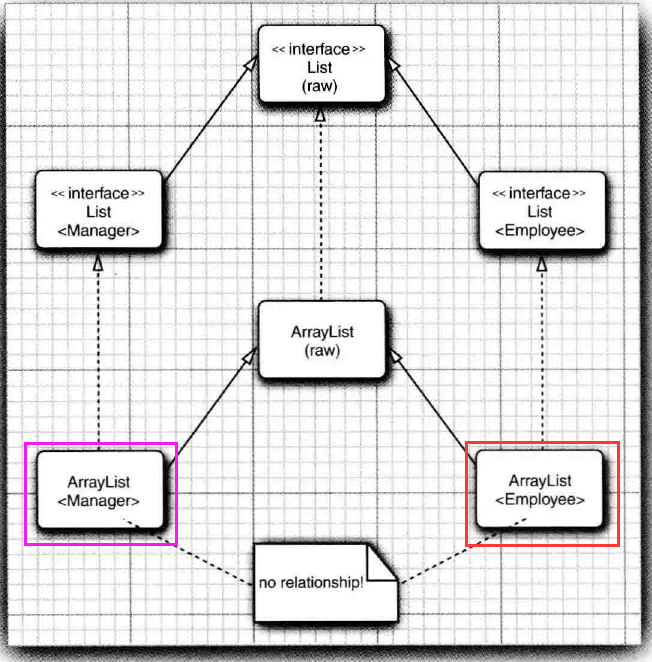
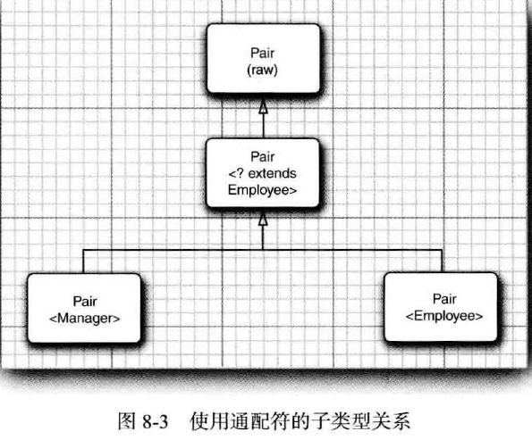

# 通配符类型

## 1.extends 限定通配符

```java
public class Main2 {
    public static void main(String[] args) {
        ArrayList<Employee> employees = new ArrayList<>();
        ArrayList<Manager> managers = new ArrayList<>();
        Main2.printEmployee(employees);
        Main2.printEmployee(managers);//Error!
    }

    public static void printEmployee(ArrayList<Employee> employees) {
        for (Employee employee : employees) {
            System.out.println(employee);
        }
    }
}
```

由于Java泛型的一些显示，ArrayList<T>与ArrayList<U>之间其实没有任何直接关系，所以上面的代码不能通过。



为了解决上述问题，Java引入了**通配符类型**。

```java
public class Main2 {
    public static void main(String[] args) {
        ArrayList<Employee> employees = new ArrayList<>();
        ArrayList<Manager> managers = new ArrayList<>();
        Main2.printEmployee(employees);
        Main2.printEmployee(managers);//OK!
    }

    public static void printEmployee(ArrayList<? extends Employee> employees) {
        for (Employee employee : employees) {
            System.out.println(employee);
        }
    }
}
```



```java
    public static void main(String[] args) {
        Employee employee;
        ArrayList<Employee> employees0 = new ArrayList<>();
        ArrayList<? extends Employee> employees1 = employees0;

        employees0.add(new Employee());//OK!
        employees0.add(new Manager());//OK!
        
        employee = employees0.get(0);//OK!
        employee = employees0.get(0);//OK!
        
        employees1.add(new Employee());//ERROR!
        employees1.add(new Manager());//ERROR!
        
        employee = employees1.get(0);//OK!
        employee = employees1.get(0);//OK!
    }
```

注意上面的代码，

## 2.super限定通配符

```java
public static void main(String[] args) {
    Employee employee;
    ArrayList<Employee> employees0 = new ArrayList<>();
    ArrayList<? super Employee> employees1 = employees0;

    employees0.add(new Employee());//OK!
    employees0.add(new Manager());//OK!

    employee = employees0.get(0);//OK!
    employee = employees0.get(0);//OK!

    employees1.add(new Employee());//OK!
    employees1.add(new Manager());//OK!

    employee = employees1.get(0);//ERROR!
    employee = employees1.get(0);//ERROR!
}
```

直观的将，带super限定的通配符可以向泛型对象写入，带有extends限定的通配符可以从泛型对象取出。

## 3.无限定通配符

```java
public static void main(String[] args) {
        ArrayList<Object> objectArrayList = new ArrayList<>();
        ArrayList<?> arrayList = new ArrayList<>();

        Integer integer = 1024;
        String string = "hello world!";
        Boolean boole = true;
        Object object = new Object();

        objectArrayList.add(integer);
        objectArrayList.add(string);
        objectArrayList.add(boole);
        objectArrayList.add(object);

        arrayList.add(integer);//ERROR!
        arrayList.add(string);//ERROR!
        arrayList.add(boole);//ERROR!
        arrayList.add(object);//ERROR!
    }
```

不细看的话，ArrayList<?>好像和ArrayList<Object>没有什么区别，但其实还是有挺大区别的。

