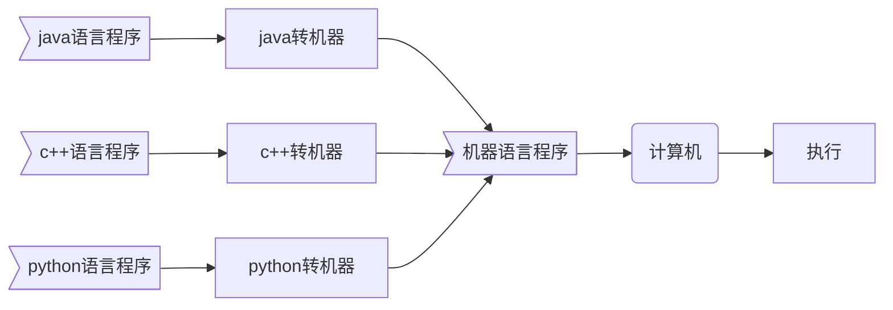
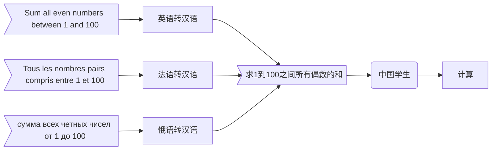
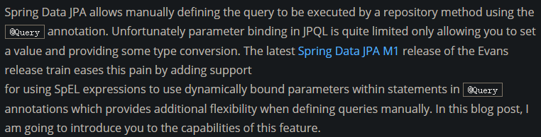
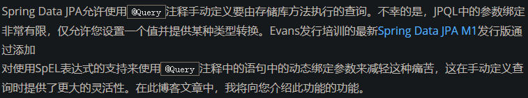
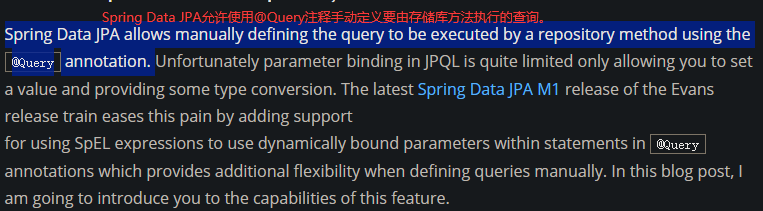
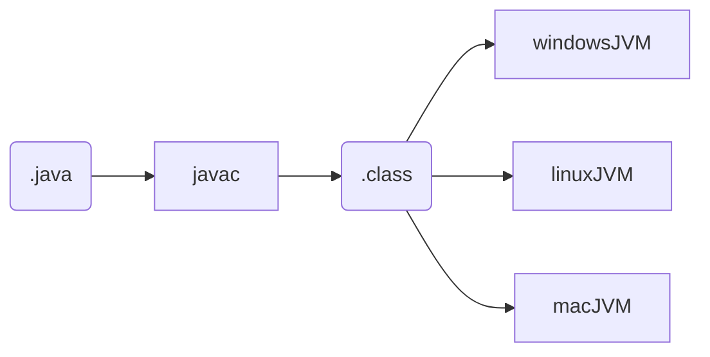
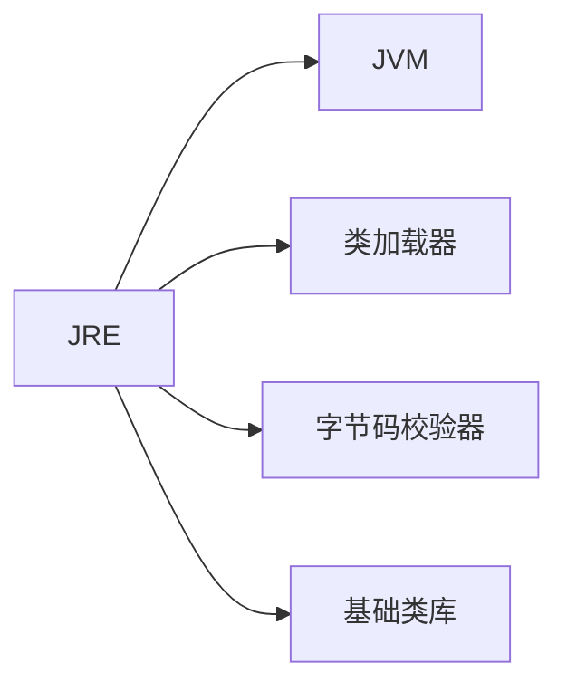
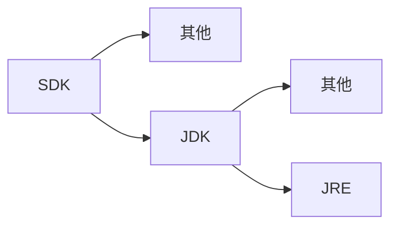

# JVM、JRE、JDK、SDK

---

## 1.JVM 

### 1.1 机器语言

语言是沟通的工具，人类有人类的语言，计算机也有计算机的语言。计算机的语言被称作机器语言，机器语言由**机器指令**组成，机器指令是由**0和1**构成的数字串。机器指令不易记忆，机器语言的使用难度很高。

计算机能够且只能够理解机器语言，其他语言编写的程序需要先转换成机器语言才能被计算机执行。

打个比方：假设中文是某学生唯一能够直接理解的语言，对于同一道题目，如果它是用中文描述的，该学生可以直接开始答题；如果该题目是用其他语言描述的，该学生需要先查阅相应的字典将题目翻译成中文才能开始答题。

### 1.2 编译型语言与解释型语言

以程序代码转换成机器指令的时机为依据，可以将编程语言划分为：编译型语言、解释型语言。

|              |     **编译型语言**     |     **解释型语言**     |
| ------------ | :--------------------: | :--------------------: |
| **转换时机** |       程序运行前       |       程序运行时       |
| **转换次数** |          1次           |          n次           |
| **转换类型** | 所有代码一次性完成转换 | 对执行到的语句进行转换 |

打个比方：假设中文是某学生唯一能够直接理解的语言，有一篇英文的文章，该学生可能需要进行多次阅读，为此，该学生可能采取的策略有：

1. 将整篇文章一次性翻译成中文并进行保存，后续使用时直接使用翻译好的文章。

2. 不进行专门的翻译，每次阅读都逐句进行翻译。

    

    
图1 英文文章

    

    
图2 一次性翻译

    

    
图3 临时翻译

### 1.3 平台相关性

Java中的int永远是32位的整数，而在C/C++中，int可能是16位整数、32位整数，也可能是编译器提供商指定的其他大小。Java语言独立于具体的平台。

### 1.4 Java与JVM

Java是平台无关的，但JVM是平台相关的：

## 3. JRE

JRE 全称 Java Runtime Environment，即Java运行时环境。JRE 是运行 Java 程序的充要条件。

### 3.1 JRE与JVM

JVM 是运行 Java 程序的必要条件，但只有JVM还不足以支持 Java 程序的运行。运行 Java 程序除了需要 JVM，还需要类加载器、字节码校验器以及大量的基础类库。JRE 包含了运行 Java 程序所必须的所有环境支持。

## 4.JDK

JDK 全称 JavaSE Development Kit，即Java标准版开发包。JDK 是一套用于开发Java程序的开发工具包，它提供了编译、运行 Java 程序所需要的各种工具和资源，包括 Java 编译器、JRE ，以及常用的Java类库。

## 5.SDK

SDK 全称 Software Development Kit，即软件开发工具包。SDK包含了JDK。

## 6.关系

