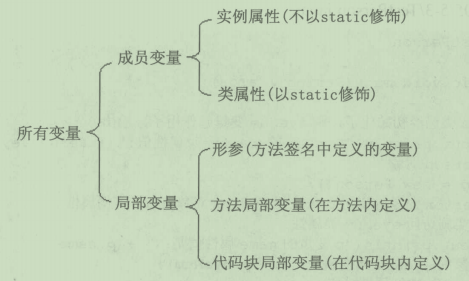

# 变量默认初始化

---

在Java语言中，根据定义变量位置的不同，可以将变量分成2个大类：成员变量和局部变量。成员变量是在类范围内定义的变量，局部变量是在方法内定义的变量。

图1 Java 变量分类

JVM 使用类之前需要先将类加载进 JVM 的运行空间，类的加载过程可以分为：加载、验证、准备、解析、初始化等几个阶段。

图2 类加载过程

## 成员变量

### 类属性

系统会在 准备阶段 为类的所有类属性分配内存，在初始化阶段对这些类属性进行初始化。

### 实例属性

创建一个 Java 对象时，系统就会为该对象包含的所有实例属性分配内存空间（前提是该类已经被加载），接着系统会对这些属性进行初始化，其初始化的顺序是：先执行初始化块或声明属性时指定的初始值，再执行构造器里指定的初始值。

与普通成员变量不同，final 成员变量必须由被显式初始化，系统不会对 final 成员进行隐式初始化。

## 局部变量

局部变量定义后，必须经过显示初始化后才能使用，系统不会为局部变量执行初始化。这意味着定义局部变量后，系统并未为这个变量分配内存空间，直到程序为这个变量赋值。