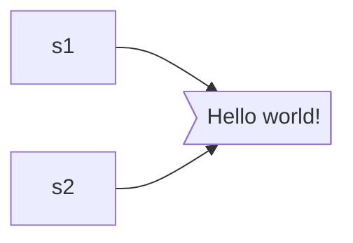
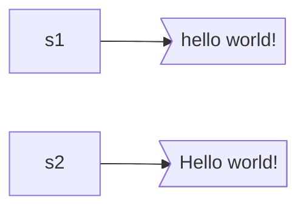
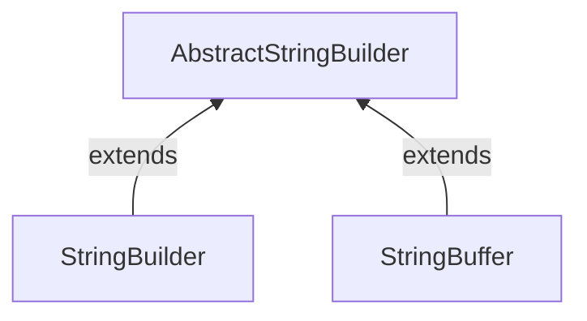

# String、StringBuffer、StringBuilder

### 1.String

Java 没有内置的字符串类型，String 是标准 Java 类库中提供的一个预定义类。每一个用双引号括起来的字符串都是 String 类的一个实例。

```java
package java.lang;

import ......
    
public final class String implement ......{
    /**
     * The value is used for character storage.
     */
    private final byte[] value;
}

```

String 类使用字符数组存储字符串，并使用了 final 关键字，所以，Java 文档中将 String 类对象称作 **不可变字符串**。不可变字符串有一个优点——字符串变得可以共享。

```java
String s1 = "Hello World!";
String s2 = "Hello World!"
s1 = "hello world!";
```



字符串 “Hello World!” 永远代表字符 H e l l o  W o r l d ! 组成的序列，不能修改其中的任何一个字符，但是可以修改 String 变量，让其指向不同的字符串。



### 2.StringBuffer、StringBuilder



```java
package java.lang;
import ...
abstract class AbstractStringBuilder implements Appendable, CharSequence {
    /**
     * The value is used for character storage.
     */    
    byte[] value;
    
    /**
     * The count is the number of characters used.
     */
    int count;

    /**
     * Appends the specified string to this character sequence.
     */
    public AbstractStringBuilder append(String str) {
        // 1.参数有效性判断
        if (str == null) {
            // 追加'n' 'u' 'l' 'l'
            return appendNull();
        }
        
        // 2.扩容 + 拷贝原值
        int len = str.length();
        ensureCapacityInternal(count + len);
        
        // 3.追加新值
        putStringAt(count, str);
        
        // 4.修改count标识
        count += len;
        return this;
    }
}
```

StringBuilder类在JDK5.0引入，该类的前生是StringBuffer。StringBuffer的效率更低，但允许采用多线程操作。两个类的API的相同的。