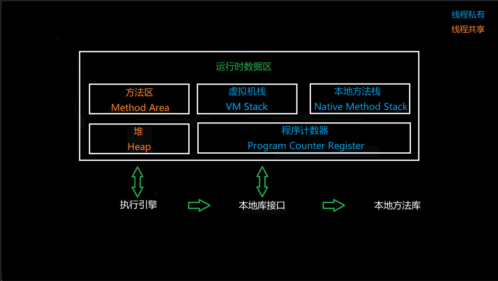
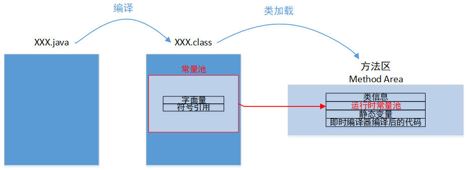
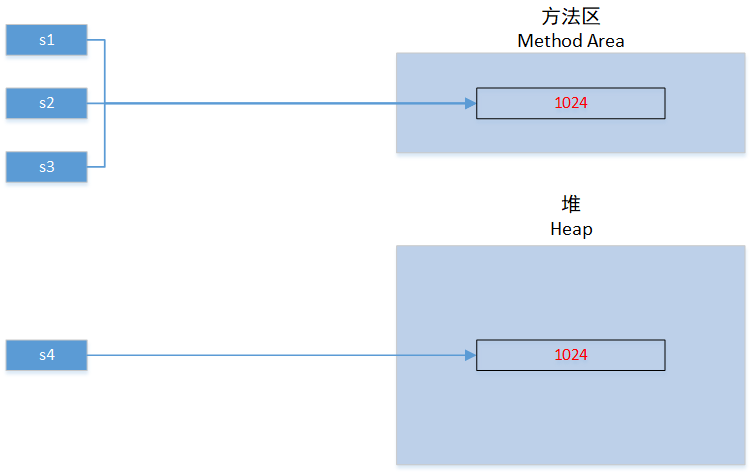

# 字符串创建 & 堆 & 常量池

### 虚拟机内存区域：



### 字面量与方法区：



### 问题分析1：

```java
public class Main {
    private static String s1 = "1024";

    public static void main(String[] args) {
        String s2 = "1024";
        String s3 = "1024";
        String s4 = new String("1024");

        System.out.println(s1 == s2); // true
        System.out.println(s2 == s3); // true
        System.out.println(s3 == s4); // false
    }
}
```




### 问题分析2

```java
public class Main {
    public static void main(String[] args) {
        String s4 = new String("1024");
        System.out.println(s4);
    }
}
```

执行语句 String s4 = new String("1024") 时，系统可能创建的String对象个数为2或1：

``` pseudocode
if( 运行时常量池中不存在"1024"字符串对象){
    在运行时常量池新增"1024"字符串对象;
}
在堆创建"1024"字符串对象;
```