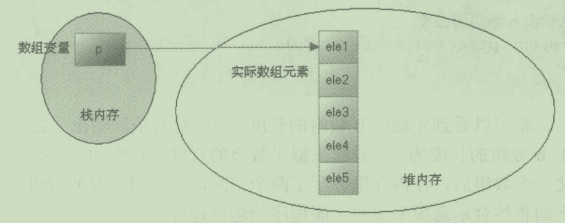
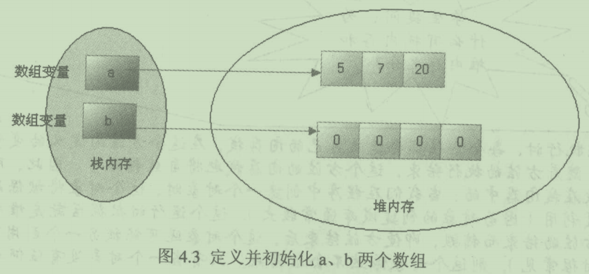
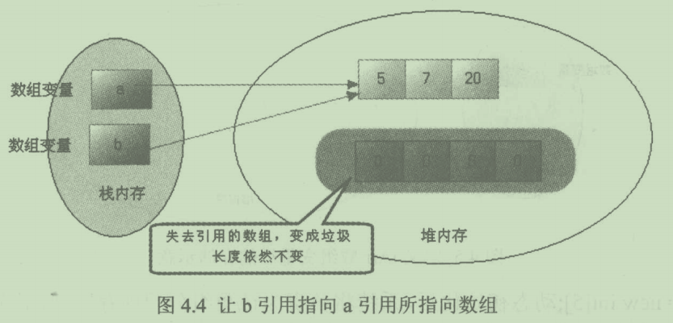

# Java 数组使用要点

---

1. 最重要的一点：<font color = red>数组是一种数据类型，它本身是一种引用类型</font>，例如，int 是一种基本类型，但 int[] 就是一种引用类型。

2. 由于数组是一种数据类型，因此，使用数组定义一个变量时，仅仅只是定义了一个引用变量，这个引用变量还未指向任何有效的内存，因此<font color = blue>定义数组时不能指定数组的长度</font>。

3. 数组的初始化方式有两种：

    - 静态初始化：程序员显示指定每个数组元素的初始值，系统计算数组长度。

    - 动态初始化：程序员指定数组长度，系统为每个数组元素设置初始值。

        ```java
        // 静态初始化数组：
        int[] intArray1 = {0, 0, 0};
        int[] intArray2 = new int[]{0, 0, 0};
        
        // 动态初始化数组：
        int[] intArray3 = new int[3];
        
        // 静态初始化和动态初始化不能同时进行，下面的代码是错误的：
        int[] intArray4 = new int[3]{0, 0, 0};
        ```

4. 数组变量存储在栈内存，数组元素存储在堆内存。

    

    当一个方法需要被执行，就会从栈内存中获取一块空间，通常我们称这块空间为栈帧。方法的开始执行以及返回，对应着栈帧的入栈和出栈。在方法内定义的变量会随着栈帧的出栈而销毁。由于创建对象的成本通常较大，因此对象被保存在堆区，方便共享。

    

    

    当我们看到一个数组时，一定要把数组看成两个部分：一个是数组引用，一个是数组本身。对于基本类型数组，数据元素直接存储数据；对于引用类型数组，数据元素存储对象的引用。

5. 关于多维数组的理解，从数组的底层运行机制来看，其实不存在多维数组。上文说到，数组也是一种数据类型，例如int[] ，那么**int[]**[]便是这种引用类型的数组，即数组元素为数组的数组。