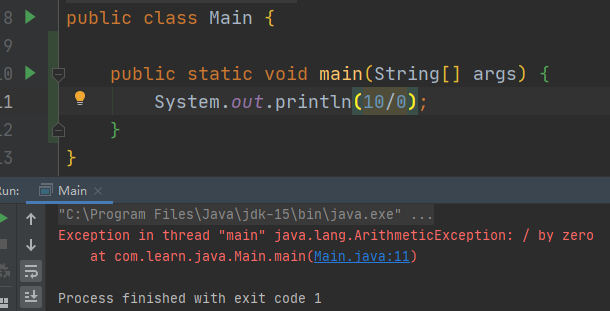
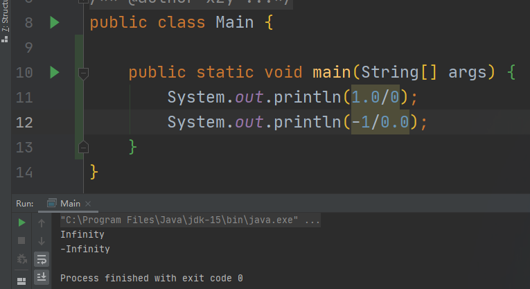

# 除法运算

---

### 除法运算：/

1. 若除数与被除数都为整数类型，运算的结果为整数类型；若除数与被除数存在浮点类型，运算的结果为浮点类型。

    ```java
    System.out.println(10/4);    //2
    System.out.println(10.0/4);  //2.5
    ```

2. 若除数与被除数都为整数类型，除数不可以为0，否则将引发异常；若除数与被除数存在浮点类型，除数可以为0或0.0，但计算的结果为正无穷大或负无穷大。



