# Iterator 接口

---

## 1. Iterator 接口在 Java 集合框架中的位置

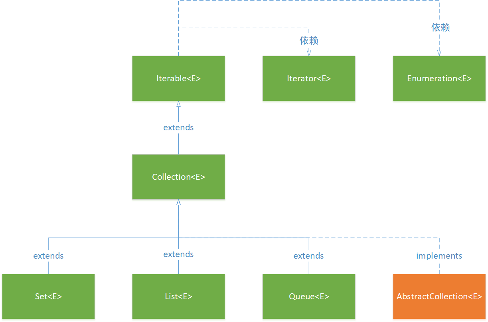

<center>图1.1 Iterator接口在Java集合框架中的位置</center>


Iterable接口部分源码：

```java
public interface Iterable<T> {
    /**
     * Returns an iterator over elements of type {@code T}.
     *
     * @return an Iterator.
     */
    Iterator<T> iterator();
    
    ......    
}
```

## 2. Iterator 接口包含的方法

在 Java 集合框架中，承装数据的任务由 Collection、Map 负责，而 Iterator 主要用于遍历（即迭代访问）集合中的元素。Iterator 接口隐藏了各种集合实现类的底层细节，向外提供了访问集合中元素的统一编程接口。Iterator 接口中包含有4个方法：

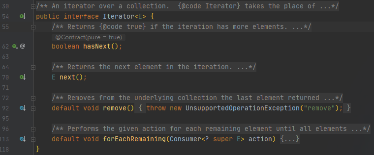

<center>图2.1 Iterator接口</center>

## 3. Iterator 接口使用方式

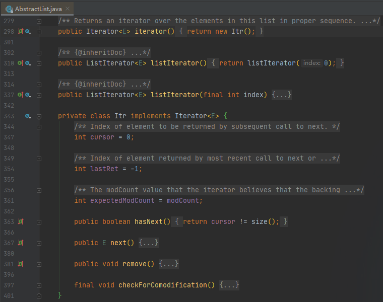

<center>图3.1 AbstractList 类中实现了 Iterator 接口的内部类</center>

一般来说，负责承装数据的集合类会在类的内部声明一个实现了 Iterator 接口的内部类。

## 4. 其他

### 4.1 Iterator 接口与 Enumeration 接口

在 Iterator 接口的源码中，有这样一段注解描述了Iterator 接口与 Enumeration 接口的基本关系：

> {@code Iterator} takes the place of {@link Enumeration} in the Java Collections Framework.  Iterators differ from enumerations in two ways:
>
> - Iterators allow the caller to remove elements from the underlying collection during the iteration with well-defined semantics.
> - Method names have been improved.

而在Enumeration接口中，也有这样一段注解：

> NOTE: The functionality of this interface is duplicated by the Iterator interface.  In addition, Iterator adds an optional remove operation, and has shorter method names.  New implementations should consider using Iterator in preference to Enumeration.

Enumeration 接口在JDK1.0 时被添加到 Java 集合框架，由于 Enumeration 接口的接口名以及接口中包含的方法的名字太长，JDK1.5时 Java 集合框架添加了 Iterator 接口用于替代 Enumeration 接口。

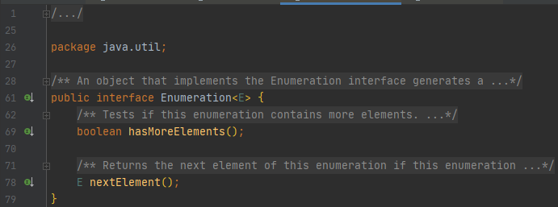

<center>图4.1 Enumeration接口</center>


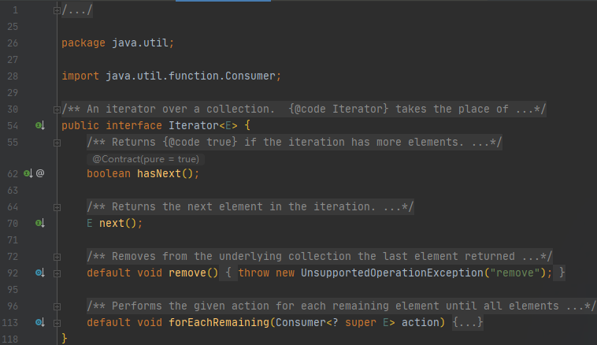

<center>图4.2 Iterator接口</center>

## 5.源码阅读

### 5.1 接口说明部分

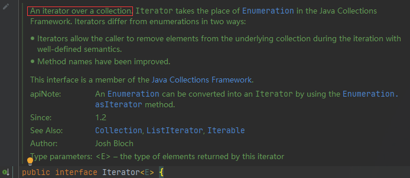

<center>图5.1 Iterator 接口注解</center>

<font color = red>An iterator over a collection.</font> Iterator 本身不装载集合元素，转载集合元素那是 Collection、Map等集合类的责任，Iterator 被用于向外界提供访问集合元素的统一接口。

### 5.2 方法说明部分

#### hasNext()

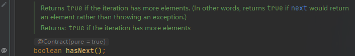

<center>图5.2 hashNext 方法注解</center>

“ if the iteration has more elements ” ：当前 Iterator 是否已经将**底层**集合中所有元素遍历完成。

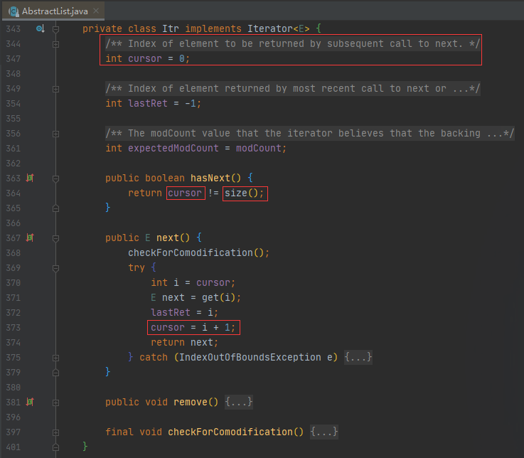

<center>图5.3 AbstractList 类中包含的 Iterator 内部类的 hasNext 方法实现</center>

#### next()

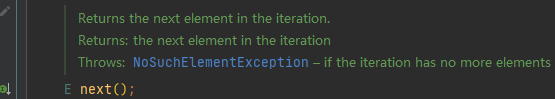

<center>图5.4 next 方法注解</center>

在当前遍历的基础上继续向后遍历一个元素，如果集合中的所有元素已经遍历完，即已经没有元素可以继续遍历，抛出 NoSuchElementException 异常。

next() 方法通常会与 hasNext() 方法搭配在一起使用 —— 在调用 next() 方法前先调用 hasNext() 方法确认集合中还有元素是当前 Iterator 尚未遍历到的。

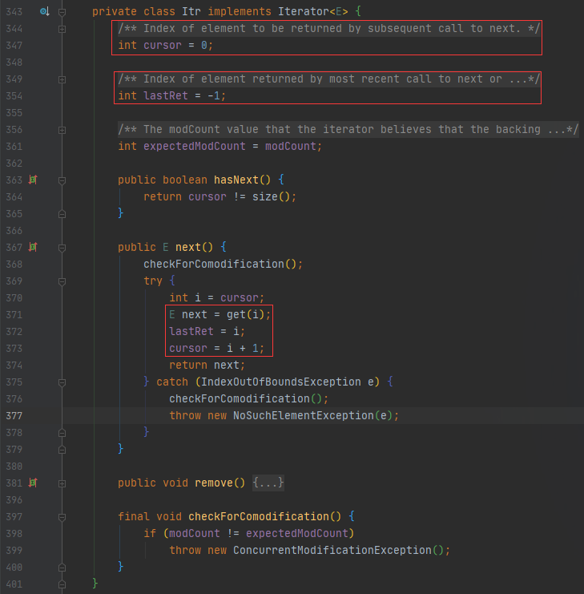

<center>图5.5 AbstractList 类中包含的 Iterator 内部类的 next 方法实现</center>

#### remove()

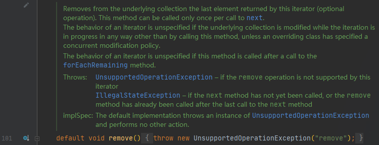

<center>图5.6 remove 方法注解</center>

从当前 Iterator 的**底层集合**上移除上一个由本 Iterator 返回的元素。

remove() 方法必须与 next() 方法配合使用：每调用 next() 方法返回一个元素，允许调用 remove() 方法删除一个元素。

如果在当前 Iterator 的使用过程中，使用了其他手段修改了底层集合，Iterator 之后的行为将失去控制。

#### forEachRemaining()

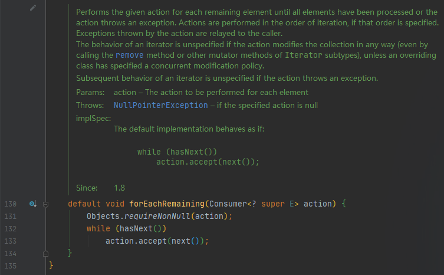