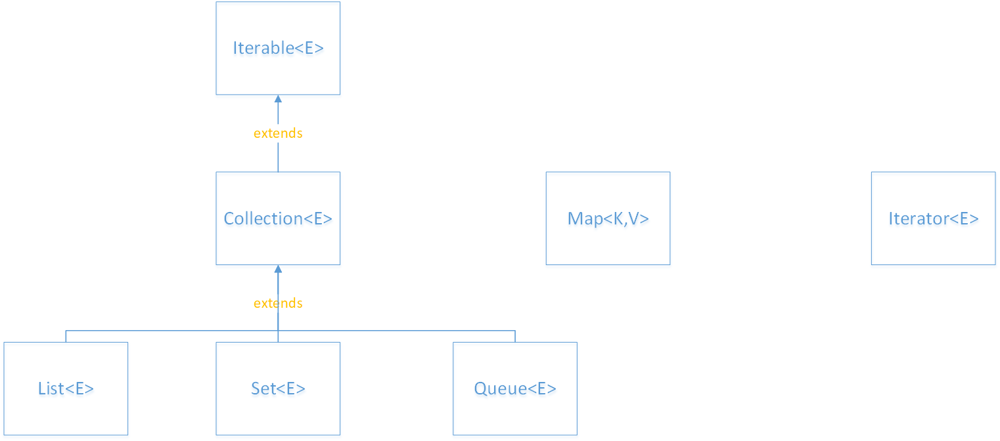

# Java集合框架

---

## 1.Collection接口

Java类库中，集合类的基本接口是Collection接口，Collection接口拓展自Iterable接口。

## 2.迭代器

Iterable接口中有一个iterator方法，该方法返回一个Iterator对象，通过调用该对象的next()、hasNext()方法可以遍历集合。不过，使用“for each”循环可以更加简洁的实现集合的遍历。

其实，for each最后也是由编译器翻译成带有迭代器的循环。

任何实现了Iterable接口的类都可以使用“for each”进行遍历。

---

