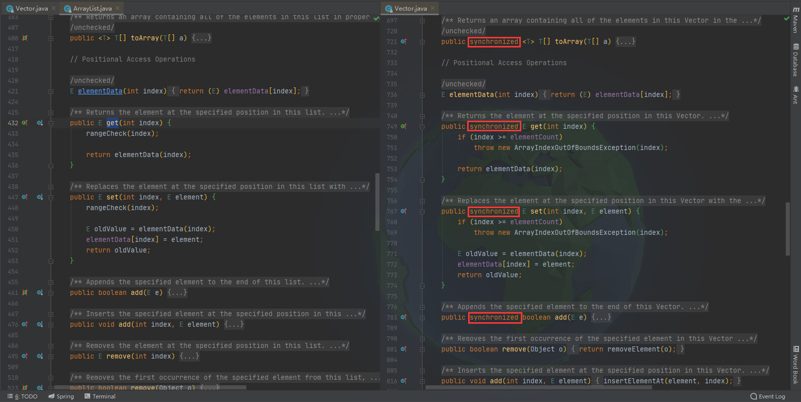

# ArrayList类与Vactor类

ArrayList和Vactor实现了同样的接口，继承自同一父类：

```java
public class ArrayList<E> 
    extends AbstractList<E>
    implements List<E>, RandomAccess, Cloneable, java.io.Serializable{...}
```

```java
public class Vector<E>
    extends AbstractList<E>
    implements List<E>, RandomAccess, Cloneable, java.io.Serializable{...}
```

从实现上看，Vactor类的许多方法支持同步：



为了支持同步，Vactor牺牲了一定的性能，所以除非必要，尽量使用ArrayList。