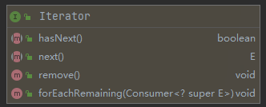

# Iterator接口源码阅读



---

## 源码查看

```java
package java.util;

import java.util.function.Consumer;
```

> An iterator over a collection. <font color = orange>Iterator takes the place of <font color = #00BFFF>Enumeration</font> in the Java Collections Framework.</font> Iterators differ from enumerations in two ways:
>
> - Iterators allow the caller to remove elements from the underlying collection during the iteration with well-defined semantics.
> - Method names have been improved.
>
> > <font color = #629755>underlying：底层的  well-defined：明确定义的  semantics：语义</font>
>
> This interface is a member of the Java Collections Framework.
>
> SInce: 1.2
>
> Author: Josh Bloch
>
> Type parameters: <E> - the type of elements returned by this iterator.

```java
public interface Iterator<E> {
```

>> Returns true if the iteration has more elements. (In other words, returns true if <font color = #00BFF>next</font> would return an element rather than throwing an exception.)
>>
>> Returns: true if the iteration has more elements.
>
>```java
>boolean hasNext();
>```
>
>>Rerurns the next element in the iteration.
>>
>>Returns: the next element in the iteration
>>
>>Throws: <font color = orange>NoSuchElementException</font> - if the iteration has no more elements. 
>
> ```java
>E next();
> ```
>
>> Removes form the underlying collection <font color = #629755>the last element returned by this iterator</font> (optional operation) <font color = orange> This method can be called only once per call to <font color = #00BFFF>next</font>.</font> <font color = orange> The behavior of an iterator is unspecified</font> <u>if the underlying collection is modified while the iteration is modified while the iteration is in progress in any way other than by calling this method.</u> 
>>
>> Throws: UnspportedOperationException - if the remove operation is not supported by this iterator.
>>
>> ​             <font color = orange>IllegalStateException</font> - <u>if the next method has not yet been called, or the remove method has                       			 already been called after the last call to the <font color = #00BFFF>next</font> method.</u> 
>
>```java
>default void remove() {
>    throw new UnsupportedOperationException("remove");
>}
>```
>
>> Performs the given action for each remaining element untill all elements have been processed or the action throws an exception. Actions are preformed in the order of iteration, if that order is specified. Exceptions thrown by the action are relayed to the caller.
>>
>> > <font color = #629755>perform：执行  remaining：剩余的  processed：处理  in the order of：按照...的顺序  relayed：传播</font>
>>
>> Params: action - The action to be performed for each element.
>>
>> Throws: NullPointerException - if the specified action is null.
>>
>> Since: 1.8
>
>```java
>default void forEachRemaining(Consumer<? super E> action) {
>    Objects.requireNonNull(action);
>    while (hasNext())
>        action.accept(next());
>}
>```

---

## 总结

1. Iterator接口被用于替代Java集合框架中的Enumeration接口。Iterator接口在包含Enumeration接口方法的同时，还提供了可以在迭代过程中，对底层集合进行修改的***remove***方法。
2. 调用next方法前，最好先调用hasNext方法判断本迭代器中是否还有元素没有迭代，避免抛出异常。
3. remove方法将上次调用next方法返回的元素从底层集合中删除。
4. 每成功调用一次next方法，允许且只允许调用一次remove方法。

```java
next();// 返回元素A
next();// 返回元素B
remove();// 从底层集合删除元素B
remove();// IllegalStateException！！！
```

```java
next();// 返回元素A
remove(); // 从底层集合删除元素A
next();// 返回元素B
remove();// 从底层集合删除元素B
```

5. 如果非本迭代器的操作修改了底层集合，迭代器的行为将无法确定。

