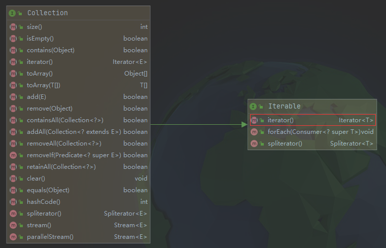

# Collection & Iterable & Iterator & Collection Framework

---

## 关系

1. Collection接口、Iterable接口、Iterator接口是Java集合框架的一部分。
2. Collection接口继承自Iterable接口，Iterable接口中的iterator方法的返回值为Iterator类型。



3. 实现了Iterable接口的对象可以使用“for each”循环进行遍历，标准类库中所有集合类都实现了Collection接口，因此都可以使用“for each”循环进行遍历。

```java
for(E element: collection){
    do something with element
}
```

4. jdk1.8开始，Iterable接口中引入了带有默认实现的forEachRemaining方法。

```java
    default void forEachRemaining(Consumer<? super E> action) {
        Objects.requireNonNull(action);
        while (hasNext())
            action.accept(next());
    }
```

配合lambda表达式，还可以用下列方式遍历结合集合中的元素：

```java
collection.forEach(element -> {
    do something with element
});
```