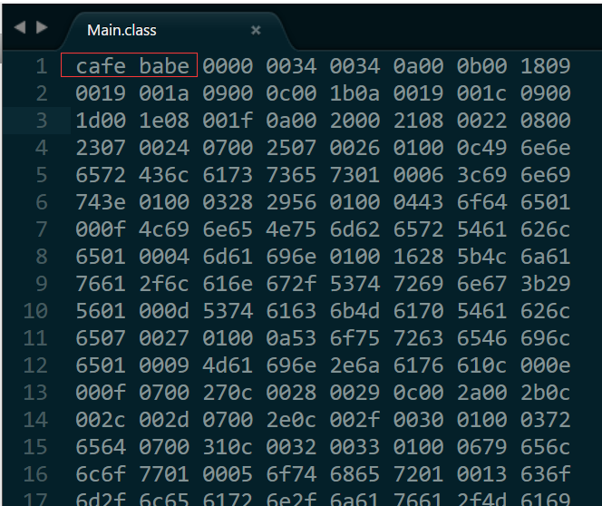

# Java中的“魔数”

在编程过程中，我们可能经常听到“魔数”、“魔法值”，那么这些词到底指的是什么呢？

---

## 文件中的“魔数”

大多数情况下，我们都是通过文件拓展名来确定一个文件的类型，比如我们看到一个拓展名为.txt的文件，我们就知道这是一个纯文本文件。但是拓展名是可以修改的，如何更准确的识别文件类型呢？

很多类型的文件，其起始地几个字节的内容是固定的（或是有意填充，或是本就如此）。这些固定的内容被称作<font color =  yellow>魔数（magic number）</font>。借助魔数，程序可以更准确、更便捷的识别文件的类型。

为了方便虚拟机识别class文件，SUN公司规定，class文件必须以`0xCAFEBABE`（4个字节）作为开始，这个数字就是魔数。

随便编译一个class文件，然后用16进制编辑器打开（这里我直接使用Sublime）：



## 代码中的“魔数”

在有些代码中，有一些数字常量或者字符串，他们没有注释，并且从命名上也看不出什么意思，很可能在过一段时间之后谁也不知道这个常量或者字符串代表什么意思。我们就称这个常量或者字符串为魔数。

在《阿里巴巴Java开发手册》中也有关于魔数的要求：


在代码中使用魔数，不仅使代码的可读性大大降低，还可能导致各种问题。所以在代码中，我们要尽量避免产生魔数。所有需要使用魔数的地方，都可以使用枚举或者静态变量来代替。譬如一个很简单的根据职位计算薪水的方法：

```java
public int getSalary(String title， int grade) {
    if ("Programmer".equals(title)){
        return grade * 500 + 700;
    }

    else if ("Tester".equals(title)){
        return grade * 500 + 800;
    }

    else if ("Analyst".equals(title)){
        return grade * 800 + 1000;
    }
}
```

在这个方法里面，”Programmer”，”Tester”和”Analyst”是所谓的魔字符串(Magic String)，而500， 700，800和1000就是所谓的魔数(Magic Number)了。 咋一看，代码这样写也没有什么问题，但是，仔细思考一下就会发现，如果这种随手捻来的字符串和数字散布于程序当中，随处可见的话，是会有很多弊病的。

如果我们使用常量来代替上面的魔数的话，代码就会清爽很多，而且，下次修改的时候只需要修改常量值就可以了：

```java
public int getSalary(String title， int grade) {
    if (Constants.TITLE_PROGRAMMER.equals(title)){
        return grade * Constants.BASE_SALARY_LOW + Constants.ALLOWANCE_LOW;
    }
    else if (Constants.TITLE_TESTER.equals(title)){
        return grade * Constants.BASE_SALARY_LOW + Constants.ALLOWANCE_MEDIUM;
    }
    else if (Constants.TITLE_ANALYST.equals(title)){
        return grade * Constants.BASE_SALARY_HIGH + Constants.ALLOWANCE_HIGH;
    }
}
```

---

参考文献：http://www.hollischuang.com/archives/491