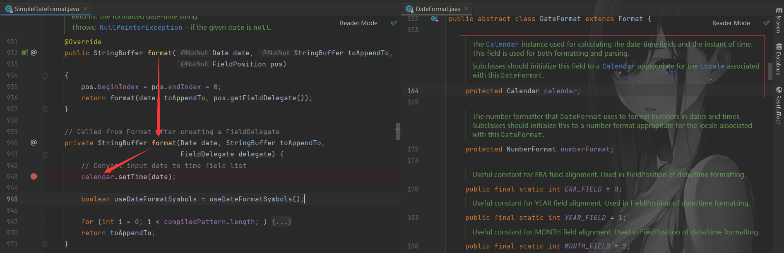

# SimpleDateFormat 为什么线程不安全？

---

业务代码：

```java
public static void main(String[] args) {
    SimpleDateFormat simpleDateFormat = new SimpleDateFormat("yyyy-MM-dd hh:mm:ss");

    Date date = new Date();
    simpleDateFormat.format(date);
}
```

底层代码：



SimpleDataFormat 进行格式化的时候需要借助内部的一个 Calendar 对象，而这个对象并没有做线程安全控制，因此 SimpleDataFormat 是线程不安全的。