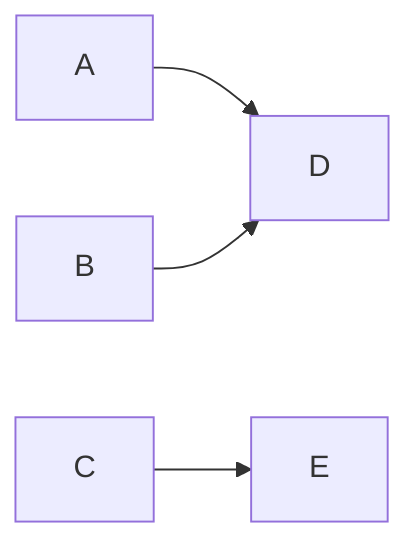

# Markdown 使用

## 1.绘图

### 1.1 mermaid



1. **绘图方向**

    TB：从上到下 
    
    ```mermaid
    graph TB
    A --> B
    ```
```
    
BT：从下到上
    
    ```mermaid
    graph BT
    A --> B
```

LR：从左到右 
    
    ```mermaid
    graph LR
    A --> B
```
    
RL：从右到左
    
    ```mermaid
    graph RL
    A --> B
```

2. **图形形状**

    矩形：

    ```mermaid
    graph LR
    id1[A] --> id2[B]
    ```
    圆角矩形：

    ```mermaid
    graph LR
    id1(A) --> id2(B)
    ```

    不对称矩形：

    ```mermaid
    graph LR
    id1>A]-->id2>B]
    ```

    菱形：

    ```mermaid
    graph LR
    id1{A} --> id2{B}
    ```

    圆形：

    ```mermaid
    graph LR
    id1((A)) --> id2((B))
    ```

3. **连接线**

    1.

    ```mermaid
    graph RL
    A --> B
    ```

    2.

    ```mermaid
    graph RL
    A --- B
    ```

    3.

    ```mermaid
    graph RL
    A -.- B
    ```

    4.

    ```mermaid
    graph RL
    A -.-> B
    ```

    5.

    ```mermaid
    graph RL
    A ==> B
    ```


## 2.绘表

### 2.1 markdown 表格

### 2.2 HTML 表格

#### 2.2.1 行、列

<table>
    <tr>
        <td>姓名</td>
        <td>性别</td>
        <td>成绩</td>
    </tr>
        <td>张三</td>
        <td>男</td>
        <td>100</td>
    </tr>
    </tr>
        <td>李四</td>
        <td>女</td>
        <td>99</td>
    </tr>
</table>

表格由 <table> 标签来定义。每个表格均有若干行（由 <tr> 标签定义，tr = table row ），每行被分割为若干单元格（由 <td> 标签定义，td = table data）。数据单元格可以包含文本、图片、列表、段落、表单、水平线、表格等等。

#### 2.2.2 边框

通过 table 标签的 border 属性可以设置表格边框的粗细：

<table border = "2">
    <tr>
        <td>姓名</td>
        <td>性别</td>
        <td>成绩</td>
    </tr>
        <td>张三</td>
        <td>男</td>
        <td>100</td>
    </tr>
    </tr>
        <td>李四</td>
        <td>女</td>
        <td>99</td>
    </tr>
</table>

<table border = "4">
    <tr>
        <td>姓名</td>
        <td>性别</td>
        <td>成绩</td>
    </tr>
        <td>张三</td>
        <td>男</td>
        <td>100</td>
    </tr>
    </tr>
        <td>李四</td>
        <td>女</td>
        <td>99</td>
    </tr>
</table>

#### 2.2.3 表头

通过<th>（table head）标签定义，表头中的文本会被加粗显示：

<table>
    <tr>
        <th>姓名</td>
        <th>性别</td>
        <th>成绩</td>
    </tr>
        <td>张三</td>
        <td>男</td>
        <td>100</td>
    </tr>
    </tr>
        <td>李四</td>
        <td>女</td>
        <td>99</td>
    </tr>
</table>

#### 2.2.4 标题

通过<caption>标签定义 ：

<table>
    <caption>成绩表</caption>
    <tr>
        <th>姓名</td>
        <th>性别</td>
        <th>成绩</td>
    </tr>
        <td>张三</td>
        <td>男</td>
        <td>100</td>
    </tr>
    </tr>
        <td>李四</td>
        <td>女</td>
        <td>99</td>
    </tr>
</table>

