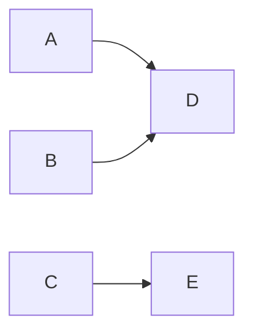

# Markdown 使用

## 1.绘图

### 1.1 mermaid



1. **绘图方向**

    TB：从上到下 
    
    ```mermaid
    graph TB
    A --> B
```
    
BT：从下到上
    
    ```mermaid
    graph BT
    A --> B
    ```
    
LR：从左到右 
    
    ```mermaid
    graph LR
    A --> B
```
    
RL：从右到左
    
    ```mermaid
    graph RL
    A --> B
```
    
2. **图形形状**

    矩形：

    ```mermaid
    graph LR
    id1[A] --> id2[B]
    ```
    圆角矩形：

    ```mermaid
    graph LR
    id1(A) --> id2(B)
    ```

    不对称矩形：

    ```mermaid
    graph LR
    id1>A]-->id2>B]
    ```

    菱形：

    ```mermaid
    graph LR
    id1{A} --> id2{B}
    ```

    圆形：

    ```mermaid
    graph LR
    id1((A)) --> id2((B))
    ```

3. **连接线**

    1.

    ```mermaid
    graph RL
    A --> B
    ```

    2.

    ```mermaid
    graph RL
    A --- B
    ```

    3.

    ```mermaid
    graph RL
    A -.- B
    ```

    4.

    ```mermaid
    graph RL
    A -.-> B
    ```

    5.

    ```mermaid
    graph RL
    A ==> B
    ```

    