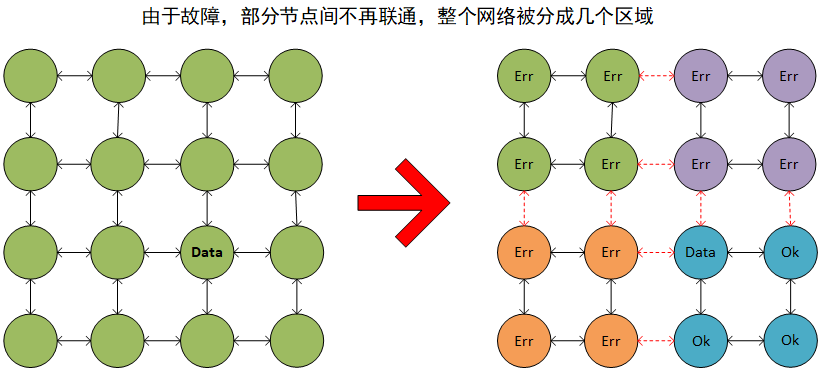
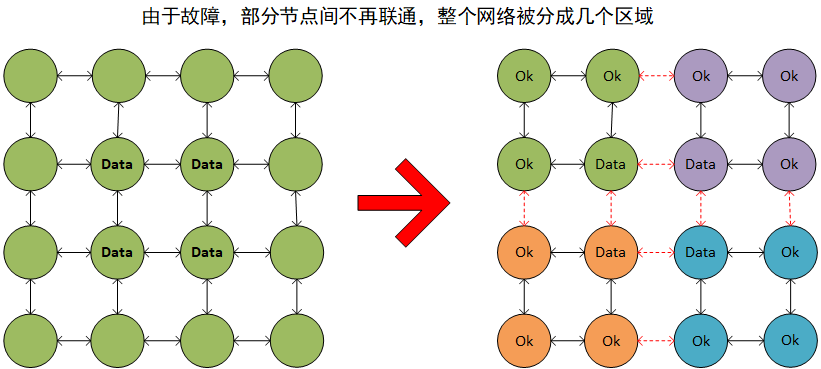

# CAP原则

---

在一个分布式系统里面，节点组成的网络本来应该是联通的，然而可能因为一些故障，使得有些节点之间不再联通了，整个网络就分成了几块区域，数据就分散在这些不连通的区域中，这就叫分区：

若一个数据项只存储在一个节点中，当分区出现后，与这个节点不联通的部分就访问不到这个数据了，这时分区就是无法容忍的：

若一个数据项复制存储在多个节点中，当分区出现后，这一数据项就可能分散在各个区里，这是分区的容忍性就提高了：

然而，要把一个数据项复制到多个节点中，就会带来一致性问题，即多个节点上存储的数据可能是不一致的。要保证一致性，每次写操作都要等待数据在所有节点写成功，而这个等待的时间可能会很长，这又将造成系统可用性的问题。

总的来说，数据存储的节点越多，分区容忍性越高，但要复制更新的数据就越多，一致性就越难保证，为了保证一致性，更新所有节点数据所需要的时间就越长，可用行就会降低。