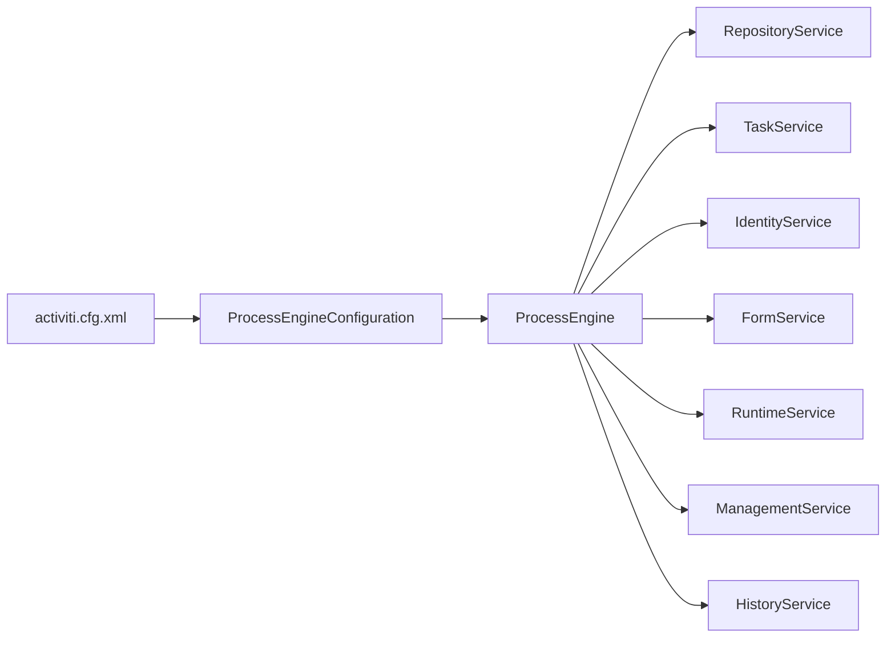

```mermaid
graph LR

1[activiti.cfg.xml]
2[ProcessEngineConfiguration]
3[ProcessEngine]
4[RepositoryService]
5[TaskService]
6[IdentityService]
7[FormService]
8[RuntimeService]
9[ManagementService]
10[HistoryService]

1-->2-->3
3-->4 
3-->5
3-->6
3-->7
3-->8
3-->9
3-->10
```