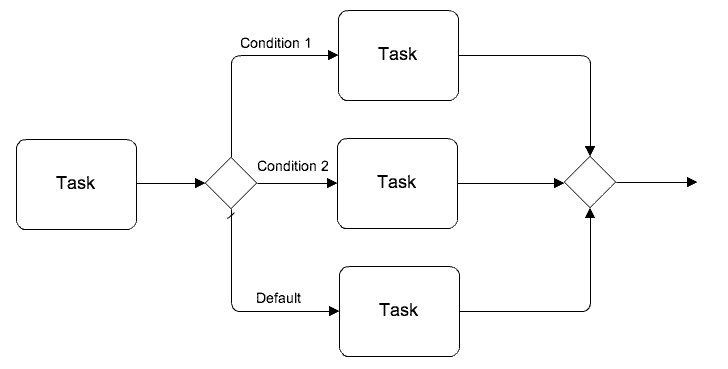
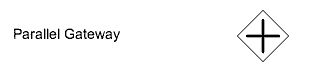
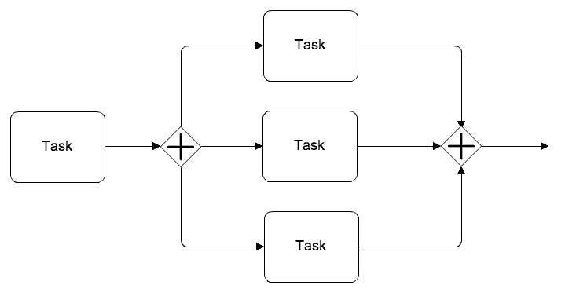
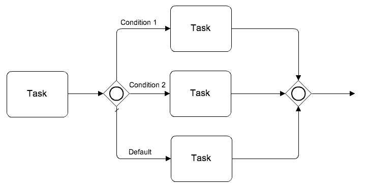

# 网关

---

网关用于控制（拆分或合并）复杂的流程走向，常见的网关有：

1. 排他网关
2. 并行网关
3. 包含网关

## 一、排他网关

<u>当用作分支网关时，专用网关可以有多条流出路径，但只能选择其中一条执行。</u>依次计算每条路径的变量条件是否为true，一旦找到变量条件成立的路径便沿着该路径向后执行，不再计算之后其他路径的变量条件；如果所有路径的变量条件都不成立，则沿着默认路径执行；如果没有设置默认路径，则产生异常。

<u>当用作聚合网关时，专用网关将直接向后传递接收到的令牌，不进行同步。</u>

## 二、并行网关

<u>当用作分支网关时，并行网关可以有多条流出路径，流程沿每条路径向后执行，不进行变量条件的计算。</u>

<u>当用作聚合网关时，并行网关将在合并和同步流之前会等待每个传入路径所有令牌的到达。</u>

## 三、包含网关

包含网关 = 排他网关 + 并行网关：

<u>当用作分支网关时，包含网关可以具有多条流出路径，与排他网关不同，流程需要执行所有变量条件为true的路径</u>。依次计算每条路径的变量条件是否成立，如果条件成立则延该路径向后发送一个令牌。如果所有路径的变量条件都不成立，则沿着默认路径执行；如果没有设置默认路径，则产生异常。

<u>当用作聚合网关时，包含网关将在合并和同步流之前会等待每个传入路径所有令牌的到达。</u>

