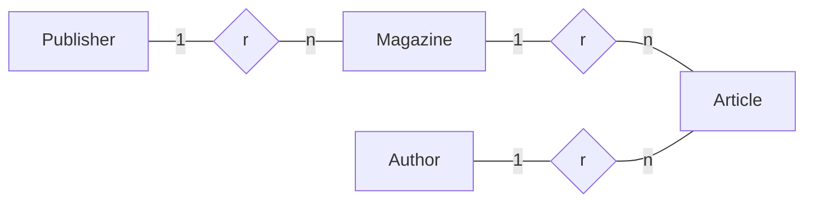
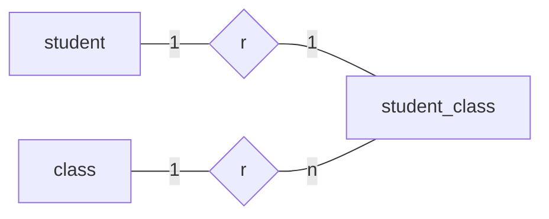

# JPQL

(https://docs.oracle.com/cd/E11035_01/kodo41/full/html/ejb3_langref.html)

---

## 1. 简介

The Java Persistence query language (JPQL) is used to define searches against persistent entities  **independent of the mechanism used to store those entities**. As such, **JPQL is "portable", and not constrained to any particular data store**. The Java Persistence query language is an extension of the Enterprise JavaBeans query language, `EJB QL`, adding operations such as bulk deletes and updates, join operations, aggregates, projections, and subqueries. Furthermore, JPQL queries can be declared statically in metadata, or can be dynamically built in code. This chapter provides the full definition of the language.

> 译：JPQL被用于声明针对实体的查询，**与存储实体的具体机制无关**。因此，**JPQL是“可移植”的，并且不受限于任何特定的数据存储方式**（mysql、oracle、sql server…）。JPQL在EJB QL的基础上，额外拓展了批量删除、批量更新、聚合、投影、子查询等功能。此外，JPQL既可以在元数据上静态声明，也可以在代码中动态构建。

---

下面是实现相同功能的SQL语句和JPQL语句：

```sql
select 
    student.id,
    student.name,
    student.age 
from 
    student 
where 
    student.age > 18 
```

```sql
select 
    student.id,
    student.name,
    student.age 
from 
    StudentEntity student
where 
    student.age > 10
```

StudentEntity是student表对应的实体类，student表的表结构以及StudentEntity类的定义如下：

​    student表表结构：

| 字段名 | 类型    | 长度 | 键   | 注释     |
| ------ | ------- | ---- | ---- | -------- |
| id     | varchar | 32   | √    |          |
| name   | varchar | 255  |      | 学生姓名 |
| age    | int     | 3    |      | 学生年龄 |
| sex    | varchar | 2    |      | 学生性别 |
| phone  | varchar | 10   |      | 联系方式 |

​    StudentEntity类：

```java
@Entity
@Table(name = "student")
public class StudentEntity {
    @Id
    private String id;
    private String studentName;
    private String studentNo;
    private Integer age;
    private String sex;
    // 此处略去 get/set方法、构造方法
}
```

---

## 2. 语句类型

**（Statement Types）**

JPQL包含select、updata、delete三种语句类型，JPQL语句既可以动态生成，也可以通过元数据注释或者XML元素静态定义。

### 2.1 Select 语句

select语句格式：

```sql
select from [where] [group by] [having] [order by]
```

### 2.2 Update & Delete 语句

update语句格式：

```sql
update 
```

delete语句格式：

```sql
delete 
```

## 3. 抽象模式类型 & 查询域

**（Abstract Schema Types and Query Domains）**

The Java Persistence query language is a typed language, and every expression has a type. The type of an expression is derived from the structure of the expression, the abstract schema types of the identification variable declarations, the types to which the persistent fields and relationships evaluate, and the types of literals. The abstract schema type of an entity is derived from the entity class and the metadata information provided by Java language annotations or in the XML descriptor.

Informally, the abstract schema type of an entity can be characterized as follows:

译：JPQL是一种类型化语言，每个表达式都有一个类型。表达式的类型来源自：表达式的结构、标识变量声明的抽象模式类型（Abstract Scheme Types）、持久化字段和关系所评估的类型、字面量的类型。实体的抽象模式类型来源自：实体类（entity class）、java注释或xml描述符提供的元数据信息。

通俗的将，实体的抽象模式类型可以描述为：

- For every persistent field or get accessor method (for a persistent property) of the entity class, there is a field (<font color = red>"state-field"</font>) whose abstract schema type corresponds to that of the field or the result type of the accessor method.

    译：实体类中持久字段的类型或对应的 get 方法的返回值类型。

    ```java
    @Entity
    @Table(name = "student")
    public class StudentEntity {
        @Id
        private String id;
        
        @Column(name = "student_name")
        private String studentName;
        
        @Column(name = "student_no")
        private String studentNo;
        
        @Column(name = "age")
        private Integer age;
        
        @Column(name = "sex")
        private String sex;
    }
    ```

    ```java
    @Entity
    @Table(name = "student")
    public class StudentEntity {
        @Id
        private String id;
        private String studentName;
        private String studentNo;
        private Integer age;
        private String sex;
        
        @Column(name = "student_name")
        public String getStudentName() { return studentName; }
        
        @Column(name = "student_no")
        public String getStudentNo() { return studentNo; }
        
        @Column(name = "age")
        public Integer getAge() { return age; }
        
        @Column(name = "sex")
        public String getSex() { return sex; }
    }
    ```

- For every persistent relationship field or get accessor method (for a persistent relationship property) of the entity class, there is a field (<font color = red>"association-field"</font>) whose type is the abstract schema type of the related entity (or, if the relationship is a one-to-many or many-to-many, a collection of such). **Abstract schema types are specific to the query language data model. The persistence provider is not required to implement or otherwise materialize an abstract schema type.** The domain of a query consists of the abstract schema types of all entities that are defined in the same persistence unit. The domain of a query may be restricted by the navigability of the relationships of the entity on which it is based. The association-fields of an entity's abstract schema type determine navigability. **Using the association-fields and their values, a query can select related entities and use their abstract schema types in the query.**

    译：抽象模式类型与查询语言数据模型（query language data model）相关。不需要持久化框架（persistence provider）来实现或以其他方式具体化抽象模式类型。查询的域（domain）包含了同一持久化单元中定义的所有实体的抽象模式类型。查询的域可能受到它所基于的实体的关系的可关联性的限制。实体的可关联性由实体抽象模式类型的关联字段确定。借助关联字段及其值，在查询中可以选择相关实体，并在查询中使用其抽象模式类型。

    ```sql
    select 
        s.studentName,
        c.className 
    from 
        StudentEntity s,
        StudentClassEntity sc,
        ClassEntity c
    where
        s.id = sc.studentId and 
        sc.classId = c.id
    ```

### 3.1 实体命名

**（Entity Naming）**

Entities are designated in query strings by their entity names. **The entity name is defined by the name element of the Entity annotation** (or the entity-name XML descriptor element), **and defaults to the unqualified name of the entity class**. Entity names are scoped within the persistence unit and must be unique within the persistence unit.

在查询语句中，通过实体名称指定实体。实体名称可以通过添加在实体上的 @Entity 注解的 name 属性设置，默认情况下，实体的名称为实体的非全限定名。实体名称的作用域在持久化单元内，并且在持久化单元内必须是唯一的。

```java
@Entity(name = "StudentEntity")
@Table(name = "student")
public class StudentEntity {
    @Id
    private String id;
    
    @Column(name = "student_name")
    private String studentName;
    
    @Column(name = "student_no")
    private String studentNo;
    
    @Column(name = "age")
    private Integer age;
    
    @Column(name = "sex")
    private String sex;
}
```

### 3.2 模式示例

**（Scheme Example）**

This example assumes that the application developer provides several entity classes representing magazines, publishers, authors, and articles. The abstract schema types for these entities are `Magazine`, `Publisher`, `Author`, and `Article`.

The entity `Publisher` has a one-to-many relationships with `Magazine`. There is also a one-to-many relationship between `Magazine` and `Article`. The entity `Article` is related to `Author` in a one-to-one relationship.

译：本示例假设应用中存在`杂志信息表`、`出版商信息表`、`作者信息表`、`文章信息表`对应的实体类，这些实体的抽象模式类型（abstract schame types）分别是`Magzaine`、`Publisher`、`Author`、`Article`，各表之间的关系如下：



Queries to select magazines can be defined by navigating over the association-fields and state-fields defined by `Magazine` and `Author`. A query to find all magazines that have unpublished articles is as follows:

```sql
SELECT DISTINCT mag 
FROM Magazine AS mag 
    JOIN mag.articles AS art 
WHERE art.published = FALSE
```

This query navigates over the association-field authors of the abstract schema type `Magazine` to find articles, and uses the state-field `published` of `Article` to select those magazines that have at least one article that is published.  **Although predefined reserved identifiers, such as `DISTINCT`, `FROM`, `AS`, `JOIN`, `WHERE`, and `FALSE`, appear in upper case in this example, predefined reserved identifiers are case insensitive.**The `SELECT` clause of this example designates the return type of this query to be of type `Magazine`.Because the same persistence unit defines the abstract persistence schemas of the related entities, the developer can also specify a query over `articles` that utilizes the abstract schema type for products, and hence the state-fields and association-fields of both the abstract schema types `Magazine` and `Author`. For example, if the abstract schema type `Author` has a state-field named `firstName`, a query over `articles` can be specified using this state-field. Such a query might be to find all magazines that have articles authored by someone with the first name "John".

```sql
SELECT DISTINCT mag 
FROM Magazine mag
    JOIN mag.articles art 
    JOIN art.author auth 
WHERE auth.firstName = 'John'
```

Because `Magazine` is related to `Author` by means of the relationships between `Magazine` and `Article` and between `Article` and `Author`, navigation using the association-fields authors and product is used to express the query. This query is specified by using the abstract schema name `Magazine`, which designates the abstract schema type over which the query ranges. The basis for the navigation is provided by the association-fields authors and product of the abstract schema types `Magazine` and `Article` respectively.

## 4. From 语句 & 导航声明

**（FROM Clause and Navigational Declarations）**

The `FROM` clause of a query defines the domain of the query by declaring identification variables. An identification variable is an identifier declared in the `FROM` clause of a query. **The domain of the query may be constrained by path expressions.** Identification variables designate instances of a particular entity abstract schema type. The `FROM` clause can contain multiple identification variable declarations separated by a comma (,).

译：查询语句中的`from`子句通过声明标识变量（identification variables）来定义查询的域（the domain of the query）。标识变量是在`from`子句中声明的标识符。查询的域可能被受路径表达式的约束。标识变量指定特定抽象模式类型（abstract schema type）的实例。`from`子句中可以包含多个标识变量的声明，并通过逗号（,）隔开。

```sql
select 
    s.studentName,
    c.className 
from 
    StudentEntity s,
    StudentClassEntity sc,
    ClassEntity c
where
    s.id = sc.studentId and 
    sc.classId = c.id
```



- from_clause ::= FROM identification_variable_declaration {, {identification_variable_declaration | collection_member_declaration}}*
- identification_variable_declaration ::= range_variable_declaration { join | fetch_join }*
- range_variable_declaration ::= abstract_schema_name [AS] identification_variable
- join ::= join_spec join_association_path_expression [AS] identification_variable
- fetch_join ::= join_spec FETCH join_association_path_expression
- join_association_path_expression ::= join_collection_valued_path_expression | join_single_valued_association_path_expression
- join_spec ::= [ LEFT [OUTER] | INNER ] JOIN
- collection_member_declaration ::= IN (collection_valued_path_expression) [AS] identification_variable

### 4.1 FROM 标识符

（FROM Identifiers）

An identifier is a character sequence of unlimited length. The character sequence must begin with a Java identifier start character, and all other characters must be Java identifier part characters. An identifier start character is any character for which the method `Character.isJavaIdentifierStart` returns `true`. This includes the underscore (_) character and the dollar-sign ($) character. An identifier-part character is any character for which the method `Character.isJavaIdentifierPart` returns `true` . The question-mark (?) character is reserved for use by the Java Persistence query language. The following are reserved identifiers:

译：标识符（identifier）是不限长度的字符系列。标识符与java中普通变量的命名要求基本相同。问号（“?”）是JPQL的保留符号，标识符不能使用。下面是JPQL的关键字：

- `SELECT`
- `FROM`
- `WHERE`
- `UPDATE`
- `DELETE`
- `JOIN`
- `OUTER`
- `INNER`
- `LEFT`
- `GROUP`
- `BY`
- `HAVING`
- `FETCH`
- `DISTINCT`
- `OBJECT`
- `NULL`
- `TRUE`
- `FALSE`
- `NOT`
- `AND`
- `OR`
- `BETWEEN`
- `LIKE`
- `IN`
- `AS`
- `UNKNOWN`
- `EMPTY`
- `MEMBER`
- `OF`
- `IS`
- `AVG`
- `MAX`
- `MIN`
- `SUM`
- `COUNT`
- `ORDER`
- `BY`
- `ASC`
- `DESC`
- `MOD`
- `UPPER`
- `LOWER`
- `TRIM`
- `POSITION`
- `CHARACTER_LENGTH`
- `CHAR_LENGTH`
- `BIT_LENGTH`
- `CURRENT_TIME`
- `CURRENT_DATE`
- `CURRENT_TIMESTAMP`
- `NEW`
- `EXISTS`
- `ALL`
- `ANY`
- `SOME`

**Reserved identifiers are case insensitive.** Reserved identifiers must not be used as identification variables. It is recommended that other SQL reserved words not be used as identification variables in queries, as they may be used as reserved identifiers in future releases of the specification.

译：JPQL的保留关键字不区分大小写。标识符不能使用JPQL保留关键字。建议不要将SQL中的其他关键字用于标识符，因为在未来的版本中，它们可能被纳为JPQL的新的保留关键字。

#### 4.1.2 标识变量

（JPQL Identification Variables）

An identification variable is a valid identifier declared in the `FROM` clause of a query. All identification variables must be declared in the `FROM` clause. Identification variables cannot be declared in other clauses. An identification variable must not be a reserved identifier or have the same name as any entity in the same persistence unit: Identification variables are case insensitive. An identification variable evaluates to a value of the type of the expression used in declaring the variable. For example, consider the previous query:

译：标识变量（Identification Variables）是`from`子句中声明的有效标识符。标识变量只能在`from`子句中声明。标识变量不能是JPQL的保留关键字，也不能是同一持久化单元中任何实体的名称（标识变量不区分大小写）。标识变量的值等于声明该变量时使用的表达式类型（the type of the expression）的值。例如，考虑下面的JPQL语句：

```sql
SELECT 
    DISTINCT mag 
FROM
    Magazine mag JOIN
    mag.articles art JOIN
    art.author auth 
WHERE 
    auth.firstName = 'John'
```

In the `FROM` clause declaration `mag.articles` `art`, the identification variable `art` evaluates to any `Article` value directly reachable from `Magazine`. The association-field `articles` is a collection of instances of the abstract schema type `Article` and the identification variable `art` refers to an element of this collection. The type of `auth` is the abstract schema type of `Author`. <u>An identification variable ranges over the abstract schema type of an entity. An identification variable designates an instance of an entity abstract schema type or an element of a collection of entity abstract schema type instances.Identification variables are existentially quantified in a query. An identification variable always designates a reference to a **single value**.</u>It is declared in one of three ways: **in a range variable declaration**, **in a join clause**, or **in a collection member declaration**. The identification variable declarations are evaluated from left to right in the `FROM` clause, and an identification variable declaration can use the result of a preceding identification variable declaration of the query string.

译：标识变量的范围涵盖实体的抽象类型。标识变量指向一个抽象类型的实例或抽象类型实例集合中的一个元素。标识变量始终代表指向单个值（single value）的引用。声明标识变量可以通过以下三种方式：

1. 在范围变量声明中（in a range variable declaration）
2. 在join子句中（in a join clause）
3. 在集合成员声明中（in a collection member declaration）

标识变量声明在from子句中从左到右求值，并且在声明当前标识变量时，可以使用当前查询语句之前标识变量的结果。


#### 4.1.3 范围声明

（Range Declarations）

The syntax for declaring an identification variable as a range variable is similar to that of SQL; optionally, it uses the AS keyword.

```sql
range_variable_declaration ::= abstract_scheme_name [AS] identification_variable
```

译：JPQL 中进行查询范围声明的语法与SQL基本相同，可选择性使用`AS`关键字。

Range variable declarations allow the developer to designate a "root" for objects which may not be reachable by navigation. In order to select values by comparing more than one instance of an entity abstract schema type, more than one identification variable ranging over the abstract schema type is needed in the `FROM` clause.

The following query returns magazines whose prices are greater than the price of magazines published by "Adventure" publishers. <u>This example illustrates the use of two different identification variables in the `FROM` clause, both of the abstract schema type `Magazine`.</u> The `SELECT` clause of this query determines that it is the magazines with prices greater than those of "Adventure" publisher's that are returned.

```sql
SELECT 
	DISTINCT mag1 
FROM 
	Magazine mag1,
    Magazine mag2
WHERE 
	mag1.price > mag2.price AND 
	mag2.publisher.name = 'Adventure'
```

#### 4.1.4 路径表达式

（Path Expressions）

#### 4.1.5 Joins

##### 4.1.5.1 Inner Joins（Relationship Joins）

##### 4.1.5.2 Outer Joins

##### 4.1.5.3 Fatch Joins