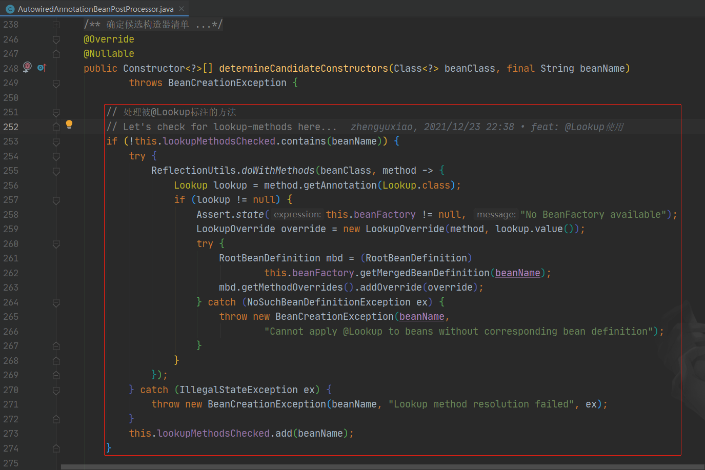
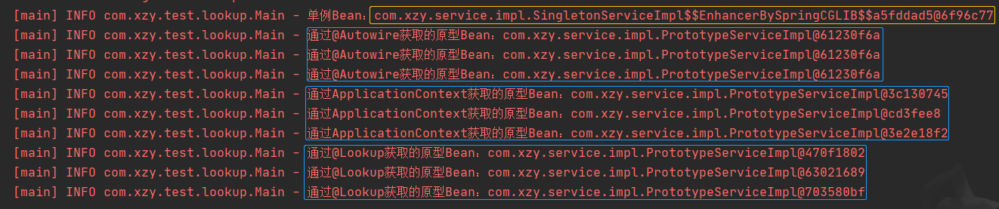
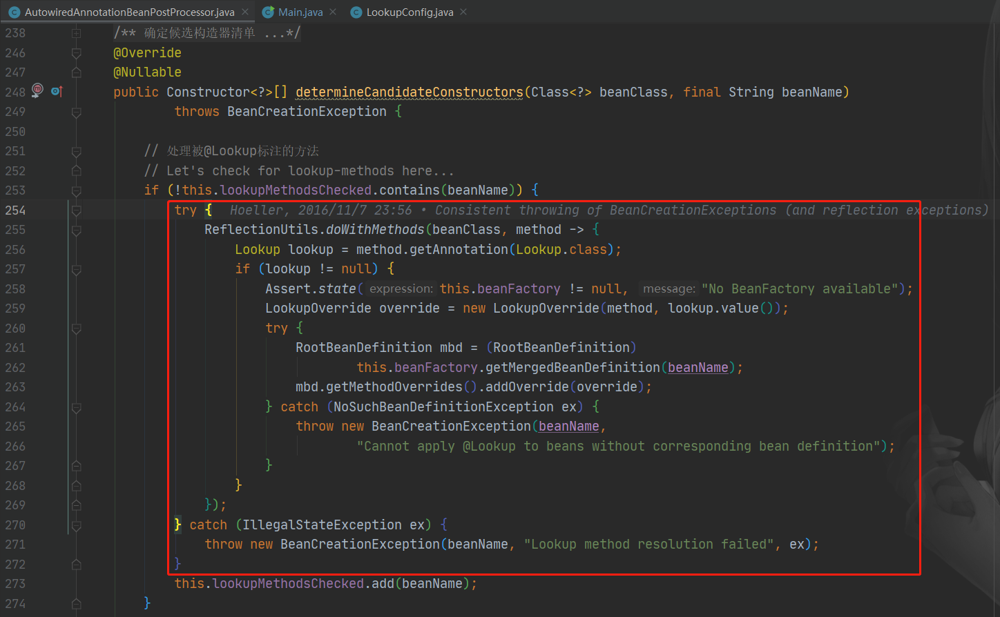
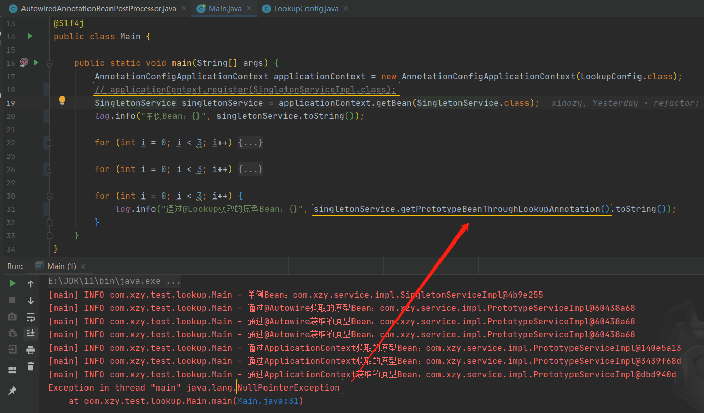

# Spring依赖注入之@Lookup注解

[TOC]

---

在了解Spring构造器推断时看到了下列源码：



## 问题分析

一般我们会使用@Autowired注解来实现依赖的自动注入：

1.   属性注入

     ```java
     @Component
     public class Xxx{
         @Autowired
         private Aaa aaa;
     }
     ```

2.   构造器注入

     ```java
     @Component
     public class Xxx{
         private final Aaa aaa;
         
         @Autowired
         public Xxx(Aaa aaa){
             this.aaa = aaa;
         }
     }
     ```

3.   普通方法注入

     ```java
     @Component
     public class Xxx{
         private final Aaa aaa;
         
         @Autowired
         public void SetAaa(Aaa aaa){
             this.aaa = aaa;
         }
     }
     ```

上述依赖注入的方式能够应付绝大多数使用场景，但一种特殊的使用场景除外：==一个单例Bean需要依赖一个原型Bean==

```java
@Component
public class SingletonBean{
    @Autowired
    private PrototypeBean prototype;
    
    public void usePrototype(){
        // use prototype bean do something
    }
}
```

在上面的代码中，SingletonBean是一个单例Bean，它依赖的PrototypeBean是一个原型Bean。因为PrototypeBean在SingletonBean的生命周期中只有一次注入的机会，所以后续usePrototype()方法使用的实际上是同一个PrototypeBean实例，显然这是有问题的：<u>虽然我们将PrototypeBean设置成了原型Bean，但是在当前的情况下，PrototypeBean变成的事实上的单例Bean。</u>

对于上述问题，一般有两种解决方案：

1.   **在Bean中引入ApplicationContext依赖，然后调用getBean()方法获取原型Bean**

     ```java
     @Component
     public class SingletonBean{
         @Autowired
         private ApplicationContext applicationContext;
         
         public void usePrototype(){
             PrototypeBean prototype = applicationContext.getBean(PrototypeBean.class);
             // use prototype bean do something
         }
     }
     ```

2.   **使用@Lookup注解**

     ```java
     @Component
     public class SingletonBean{
         
         public void usePrototype(){
             PrototypeBean prototype = getPrototypeBean();
             // use prototype bean do something
         }
         
         @Lookup
         public PrototypeBean getPrototypeBean(){
             return null;
         }
     }
     ```

     使用方法注入的方法需要满足以下语法要求：

     ```tex
     <public|protected> [abstract] <return-type> theMethodName(no-arguments);
     ```

     -   方法访问权限必须为public或protected：这与@Lookup的底层原理有关——动态代理
     -   abstract（可选）：如果是抽象方法，代理类会实现这方法；如果不是抽象方法，代理类会覆盖这方法
     -   return-type：原型Bean的类型
     -   no-arguments：参数列表必须为空

## 代码验证

声明原型Bean：

```java
public class LookupConfig {
   @Bean
   @Scope(value = BeanDefinition.SCOPE_PROTOTYPE)
   public PrototypeService prototypeService() {
      return new PrototypeServiceImpl();
   }
}
```

依赖原型Bean的单例Bean：

```java
public class SingletonServiceImpl implements SingletonService {
    
   private final PrototypeService prototypeBean;
   private final ApplicationContext applicationContext;

   @Autowired
   public SingletonServiceImpl(PrototypeService prototypeBean, ApplicationContext applicationContext) {
      this.prototypeBean = prototypeBean;
      this.applicationContext = applicationContext;
   }

   /**
    * 获取原型Bean
    *
    * @return 通过@Autowired获取的原型Bean
    */
   @Override
   public PrototypeService getPrototypeBeanThroughAutowiredAnnotation() {
      return this.prototypeBean;
   }

   /**
    * 获取原型Bean
    *
    * @return 通过ApplicationContext获取的原型Bean
    */
   @Override
   public PrototypeService getPrototypeBeanThroughApplicationContext() {
      return this.applicationContext.getBean(PrototypeService.class);
   }

   /**
    * 获取原型Bean
    *
    * @return 通过@Lookup获取的原型Bean
    */
   @Lookup
   @Override
   public PrototypeService getPrototypeBeanThroughLookupAnnotation() {
      return null;
   }
}
```

测试代码：

```java
@Slf4j
public class Main {

	public static void main(String[] args) {
		AnnotationConfigApplicationContext applicationContext = new AnnotationConfigApplicationContext(LookupConfig.class);
		applicationContext.register(SingletonServiceImpl.class);
		SingletonService singletonService = applicationContext.getBean(SingletonService.class);
		log.info("单例Bean：{}", singletonService.toString());

		for (int i = 0; i < 3; i++) {
			log.info("通过@Autowire获取的原型Bean：{}", singletonService.getPrototypeBeanThroughAutowiredAnnotation().toString());
		}

		for (int i = 0; i < 3; i++) {
			log.info("通过ApplicationContext获取的原型Bean：{}", singletonService.getPrototypeBeanThroughApplicationContext().toString());
		}

		for (int i = 0; i < 3; i++) {
			log.info("通过@Lookup获取的原型Bean：{}", singletonService.getPrototypeBeanThroughLookupAnnotation().toString());
		}
	}
}
```

测试代码执行结果：



```tex
[main] INFO com.xzy.test.lookup.Main - 单例Bean：com.xzy.service.impl.SingletonServiceImpl$$EnhancerBySpringCGLIB$$a5fddad5@6f96c77
[main] INFO com.xzy.test.lookup.Main - 通过@Autowire获取的原型Bean：com.xzy.service.impl.PrototypeServiceImpl@61230f6a
[main] INFO com.xzy.test.lookup.Main - 通过@Autowire获取的原型Bean：com.xzy.service.impl.PrototypeServiceImpl@61230f6a
[main] INFO com.xzy.test.lookup.Main - 通过@Autowire获取的原型Bean：com.xzy.service.impl.PrototypeServiceImpl@61230f6a
[main] INFO com.xzy.test.lookup.Main - 通过ApplicationContext获取的原型Bean：com.xzy.service.impl.PrototypeServiceImpl@3c130745
[main] INFO com.xzy.test.lookup.Main - 通过ApplicationContext获取的原型Bean：com.xzy.service.impl.PrototypeServiceImpl@cd3fee8
[main] INFO com.xzy.test.lookup.Main - 通过ApplicationContext获取的原型Bean：com.xzy.service.impl.PrototypeServiceImpl@3e2e18f2
[main] INFO com.xzy.test.lookup.Main - 通过@Lookup获取的原型Bean：com.xzy.service.impl.PrototypeServiceImpl@470f1802
[main] INFO com.xzy.test.lookup.Main - 通过@Lookup获取的原型Bean：com.xzy.service.impl.PrototypeServiceImpl@63021689
[main] INFO com.xzy.test.lookup.Main - 通过@Lookup获取的原型Bean：com.xzy.service.impl.PrototypeServiceImpl@703580bf
```

从执行结果可以看出：Spring使用CGLIB创建了SingletonServiceImpl的代理类

## 注意事项

-   Spring会通过CGLIB创建代理对象，然后实现或覆盖@Lookup标注的方法，因此@Lookup标注的方法内部是什么逻辑不重要，直接  return null 就行

-   回到本文最开始的地方，处理@Lookup的代码存在于Spring推断构造器的方法中：

    

    这意味着，如果以手动方式声明Bean，@Lookup就不会生效：

    ```java
    @Bean
    @Scope(value = BeanDefinition.SCOPE_SINGLETON)
    public SingletonService singletonService(PrototypeService prototypeService, ApplicationContext applicationContext) {
       return new SingletonServiceImpl(prototypeService, applicationContext);
    }
    ```

    

    （由于手动声明的方式已经告诉了Spring使用哪个构造方法实例化Bean，所以Spring就不需要再进行构造器推断，所以处理@Lookup的代码就不会执行，所有就不会创建代理类，所以实际调用的就是SingleServiceImple中的那个返回null的方法，所以NPE了）

    ---

参考文章：[spring中@Lookup的作用](https://www.cnblogs.com/wl20200316/p/12850300.html)