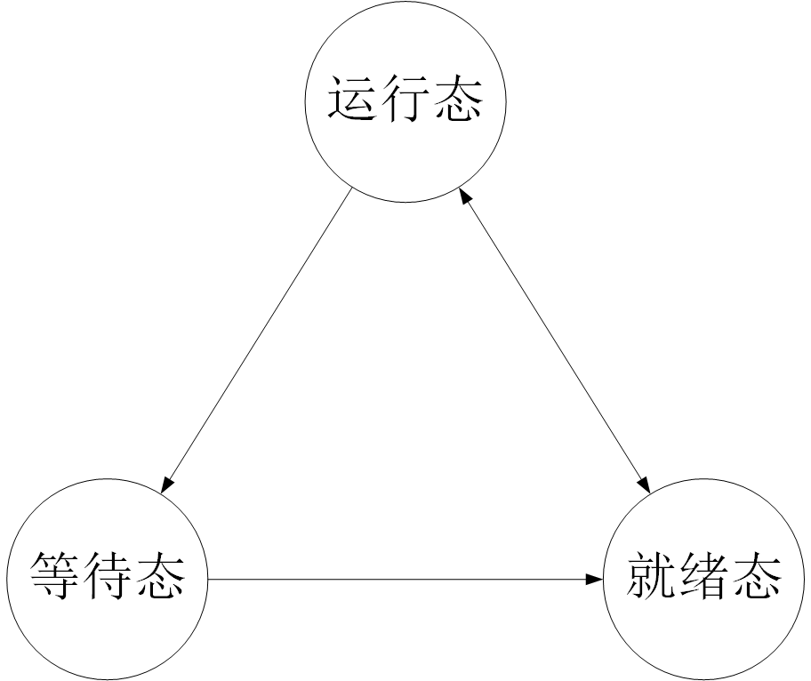

# 进程状态

---

一个进程的生命周期可以划分为一组状态，这些状态刻画了整个进程。进程状态即体现一个进程的生命状态，进程状态由进程本身和外部条件共同决定。在三态模型中，进程状态分为运行态、就绪态、阻塞态。在五态模型中，进程被分为新建态、运行态、就绪态、阻塞态、终止态。

## 三态模型

- 运行态（running）：进程占有处理器正在运行。

- 就绪态（ready）：进程具备运行条件，待系统分配处理器即可运行。

- 等待态（wait）：又称阻塞态（blocked）、睡眠态（sleep），指进程不具备运行条件，正在等待某个条件变量。

> 运行态→就绪态：时间片耗尽，或被高优先级进程抢占处理器。
>
> 运行态→等待态：等待某个资源，或某事件发生。
>
> 等待态→就绪态：资源得到满足，或某事件已经发生。
>
> 就绪态→运行态：分配到处理器。

## 五态模型

在实际系统中，进程状态及转换比上面叙述的更加复杂，为此，引入新建态和终止态。

