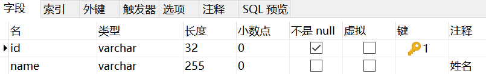
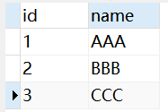
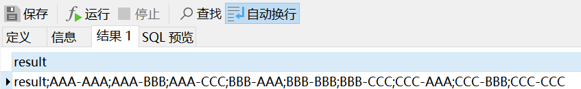

# 游标嵌套遍历

---

user表：



```mysql
CREATE DEFINER=`root`@`localhost` PROCEDURE `test`()
BEGIN
    DECLARE user1 VARCHAR(100);
    DECLARE user2 VARCHAR(100);
    DECLARE done INT DEFAULT 0;
    DECLARE cursor_user1 CURSOR FOR(SELECT `name` FROM `user`); -- 定于游标1
    DECLARE cursor_user2 CURSOR FOR(SELECT `name` FROM `user`); -- 定义游标2
    DECLARE CONTINUE HANDLER FOR NOT FOUND SET done = 1; -- 结束标识
    
    OPEN cursor_user1; -- 开启游标1
    loop_1: LOOP -- 外层循环
    -- -------------------------------------------------------------------------------------
			# 尝试从游标1指向的数据集合获取数据，如果集合已经遍历完毕，done的值被设置为1。
			FETCH cursor_user1 INTO user1;
			IF done = 1 THEN LEAVE loop_1; END IF; -- 外层循环结束条件
			
			OPEN cursor_user2; -- 开启游标2
			loop_2: LOOP -- 内层循环
			-- -----------------------------------------------------------------------------
					# 尝试从游标2指向的数据集合获取数据，如果集合已经遍历完毕，done的值被设置为1。
					FETCH cursor_user2 INTO user2;
					IF done = 1 THEN LEAVE loop_2; END IF; -- 内层循环结束条件
					
					# do something...
					
		    -- -----------------------------------------------------------------------------
			END LOOP loop_2;
			CLOSE cursor_user2; -- 关闭游标2
			
			SET done = 0; -- important
    -- ------------------------------------------------------------------------------------
    END LOOP loop_1;
    CLOSE cursor_user1; -- 关闭游标1
END
```

## 测试

user表数据：



```mysql
CREATE DEFINER=`root`@`localhost` PROCEDURE `test`()
BEGIN
    DECLARE result VARCHAR(2000) DEFAULT 'result';
    DECLARE user1 VARCHAR(100);
    DECLARE user2 VARCHAR(100);
    DECLARE done INT DEFAULT 0;
    DECLARE cursor_user1 CURSOR FOR(SELECT `name` FROM `user`); -- 定于游标1
    DECLARE cursor_user2 CURSOR FOR(SELECT `name` FROM `user`); -- 定义游标2
    DECLARE CONTINUE HANDLER FOR NOT FOUND SET done = 1; -- 结束标识
    
    OPEN cursor_user1; -- 开启游标1
    loop_1: LOOP -- 外层循环
    -- -------------------------------------------------------------------------------------
			# 尝试从游标1指向的数据集合获取数据，如果集合已经遍历完毕，done的值被设置为1。
			FETCH cursor_user1 INTO user1;
			IF done = 1 THEN LEAVE loop_1; END IF; -- 外层循环结束条件
			
			OPEN cursor_user2; -- 开启游标2
			loop_2: LOOP -- 内层循环
			-- -----------------------------------------------------------------------------
					# 尝试从游标2指向的数据集合获取数据，如果集合已经遍历完毕，done的值被设置为1。
					FETCH cursor_user2 INTO user2;
					IF done = 1 THEN LEAVE loop_2; END IF; -- 内层循环结束条件
					
					# do something...
					SET result = CONCAT(result,';',user1,'-',user2);
					
		    -- -----------------------------------------------------------------------------
			END LOOP loop_2;
			CLOSE cursor_user2; -- 关闭游标2
			
			SET done = 0; -- important
    -- ------------------------------------------------------------------------------------
    END LOOP loop_1;
    CLOSE cursor_user1; -- 关闭游标1
	SELECT result; 
END
```

执行结果：

