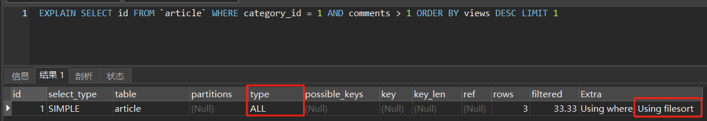
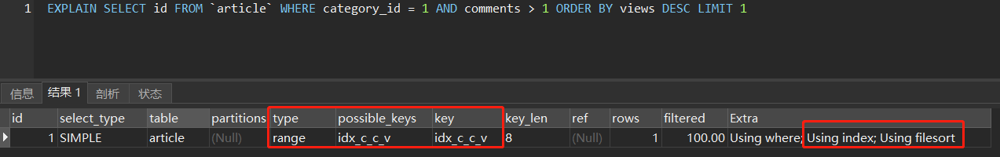
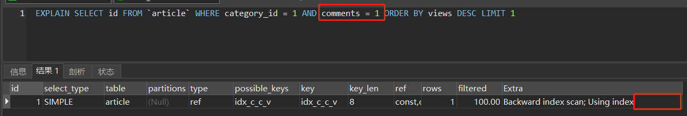
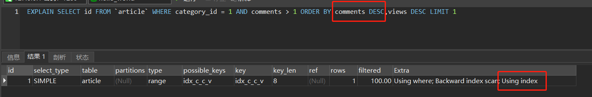
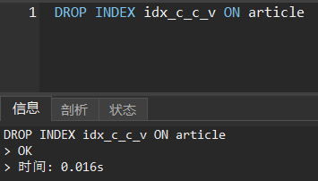
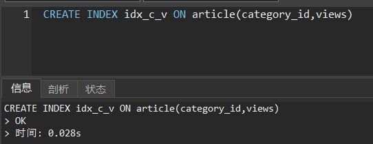
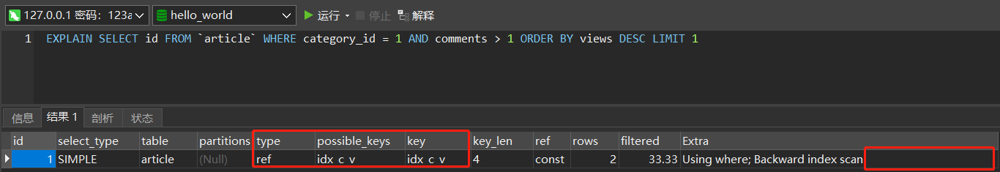

# 范围查询导致排序时索引失效

---

**题目：查询 category_id = 1  且 comments > 1 的 views 值最大的记录的article_id**（建表SQL如下）

```mysql
CREATE TABLE IF NOT EXISTS `article` (
`id` INT(10) UNSIGNED NOT NULL PRIMARY KEY AUTO_INCREMENT,
`author_id` INT(10) UNSIGNED NOT NULL,
`category_id` INT(10) UNSIGNED NOT NULL,
`views` INT(10) UNSIGNED NOT NULL,
`comments` INT(10) UNSIGNED NOT NULL,
`title` VARBINARY(255) NOT NULL,
`content` TEXT NOT NULL
);
 
INSERT INTO `article`(`author_id`, `category_id`, `views`, `comments`, `title`, `content`) VALUES
(1, 1, 1, 1, '1', '1'),
(2, 2, 2, 2, '2', '2'),
(1, 1, 3, 3, '3', '3');
 
SELECT * FROM article;
```

---

**查询1：**

从上述Explain的结果可以分析出下列信息：

1.  以全表扫描的形式获取数据，很糟糕
2.  排序的时候没有使用到已有的索引，很糟糕

**查询2：**
上述查询存在性能问题，尝试通过创建索引进行优化，在检索列和排序列创建复合索引：

```mysql
CREATE INDEX idx_c_c_v ON article(category_id,comments,views)
```

再次尝试查询：



从上述Explain的结果可以分析出下列信息：

1.  查询类型由全表扫描优化为范围查询，效率有所提升
2.  查询检索列时使用到了刚才创建的idx_c_c_v索引
3.  排序的时候还是没有使用到已有的索引

**查询3：**

去除查询条件中的范围查询，再次尝试查询：



从上述Explain的结果可以分析得到下列信息：

1.  不但在查询检索列时使用到了索引，在排序的时候也成功使用到了索引


**<font color = red>比较查询2、3的结果可以发现，仅仅由于查询2的comments是范围查询，查询2的排序就无法使用刚才创建的索引，这是为什么？</font>**

答：<u>BTree的工作原理——先根据category_id进行排序，如果遇到category_id相同的数据则根据comments继续进行排序，如果遇到comments也相同的数据则根据views继续进行排序。换而言之，能够使用comments进行排序的前提是已经使用category_id排好序，能够使用views进行排序的前提是已经使用category_id和comments排好序。</u>

<u>在查询2中，最终检索到的数据的category_id和comments的值都是一样的，此时只需要根据views进行排序即可，因此可以使用覆索引。</u>

<u>在查询1中，由于comments是范围判断，最终检索到的数据的category_id虽然是一样的，但是comments的值是不一样的，在没有先根据comments进行排序前，根本没有办法使用views进行排序！因此没有办法使用索引！</u>

**验证1**：使用views进行排序前，先使用comments对数据进行排序。如果上文是对的，此时索引应该生效。



**验证2：**修改索引，“绕开”comments字段——删除原索引，创建category_id和views的联合索引。如果上文是对的，此时索引应该生效。





