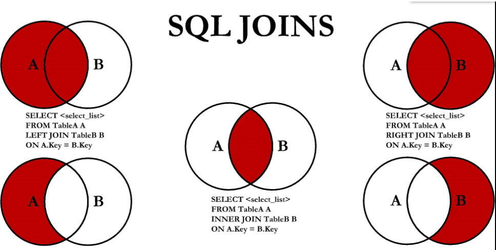

# 查询优化：连接查询与索引

---

表结构：


## inner join

### 查询1：左右表都没有可用索引

```mysql
explain select * from class inner join book on class.card = book.card;
```


查询class表和book表时均进行全表扫描，效率很低。

### 查询2：仅右表有可用索引


在book表创建索引后，查询book表时使用了索引，效率有部分提升。由于class表是驱动表（主表）且不存在可用索引，因此查询class采用全表扫描。


### 查询3：仅左表有可用索引


在class表创建索引后，查询class表时使用了索引，效率有部分提升。

查询class、book表的顺序发生了改变：查询1中先查询book表后查询class表，查询2先查询class表后查询book表。我觉得应该是查询优化器进行了优化：

1.  在关联查询中，主表需要全表扫描，最多优化为index（索引扫描）
2.  在关联查询中，驱动表不一定是全表扫面，存在优化的可能
3.  inner join 中，任意一个表都可以作为驱动表

综合以上几点，查询优化器可能将不存在可用索引的book表作为驱动表（主表），将存在索引的class表作为被驱动表（关联表）


### 查询4：左右表都有可用索引


class表和book表都创建索引后，查询两个表都用到了索引，效率提升较大。

查询classs、book表的顺序又发生了变化：又恢复成了查询1中的顺序。我猜测应该是因为现在两个表都存在可以使用的索引，索引没必要调整驱动表（主表）

## left join

### 查询1：所有表都没有可用索引


### 查询2：仅右表有可用索引


### 查询3：仅左表有可用索引


### 查询4：左右表都有可用索引


## right join

### 查询1：所有表都没有可用索引


### 查询2：仅右表有可用索引


### 查询3：仅左表有可用索引


### 查询4：左右表都有可用索引


## 总结

innder join：没有固定的驱动表，因此至少选择一张表创建索引

left join：left join 左侧的表是驱动表，由于驱动表中的数据需要全部遍历，因此给驱动表创建索引带来的查询效率提升比较有限，主要给 left join 右侧的被驱动表创建索引。

right join：right join 右侧的表是驱动表，由于驱动表中的数据需要全部遍历，因此给驱动表创建索引带来的查询效率提升比较有限，主要给 right join 左侧的被驱动表创建索引。

