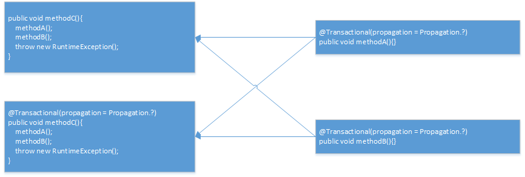

# Spring的7种事务传播行为

---

- **REQUIRED** 

    如果外围方法开启事务，则加入该事务；如果外围方法未开启事务，则创建自己的事务，在自己的事务内执行。

    

- **REQUIRED_NEW**

    无论外围方法是否开启事务，都创建自己的事务，在自己的事务内执行。

    

- **SUPPORTS**  支持的

    如果外围方法开启事务，则加入该事务；如果外围方法未开启事务，则以无事务执行。

    

- **NOT_SUPPORTED**

    以非事务方式执行操作，如果外围方法开启事务，就把当前事务挂起。

    

- **MANDATORY** 强制的

    如果外围方法开启事务，则加入该事务；如果外围方法未开启事务，则抛出异常。

    

- **NEVER**

    以非事务方式执行，如果外围方法开启事务，则抛出异常。

    

- **NESTED**  嵌套的

    如果外围方法开启事务，则在嵌套事务内执行。如果当前没有事务，则执行与PROPAGATION_REQUIRED类似的操作。

    

