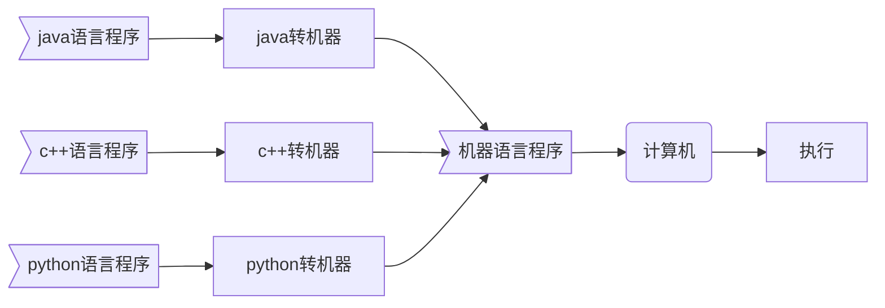
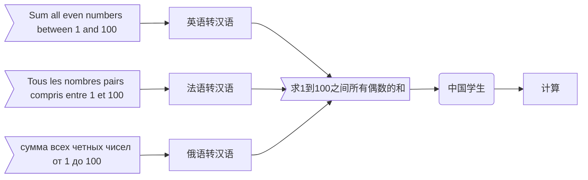
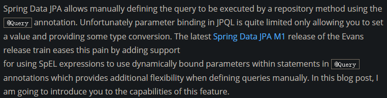
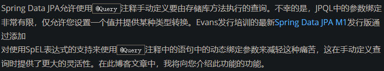
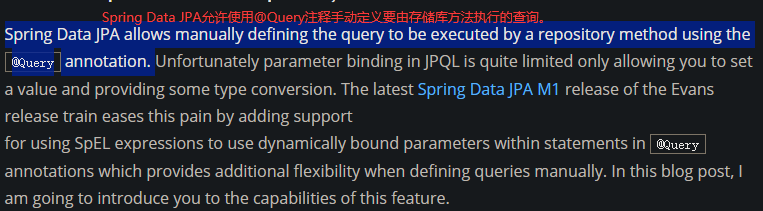

# JVM、JRE、JDK、SDK

---

## 1.JVM 

### 1.1 机器语言

语言是沟通的工具，人类有人类的语言，计算机也有计算机的语言。计算机的语言被称作机器语言，机器语言由机器指令组成，机器指令是由0和1构成的数字串。由于机器语言与我们习惯使用的语言差异较大，因而使用机器语言编写程序十分困难。

由于计算机能够且只能够理解机器语言，因而其他语言编写的程序需要被转换成机器语言才能被计算机执行。

打个比方：假设中文是某学生唯一能够直接理解的语言，对于同一道题目，如果它是用中文描述的，该学生可以直接开始答题；如果该题目是用其他语言描述的，该学生需要先查阅相应的字典将题目翻译成中文才能开始答题。

### 1.2 编译型语言与解释型语言

以程序代码转换成机器指令的时机为依据，可以将编程语言划分为：编译型语言、解释型语言。

|              |     **编译型语言**     |     **解释型语言**     |
| ------------ | :--------------------: | :--------------------: |
| **转换时机** |       程序运行前       |       程序运行时       |
| **转换次数** |          1次           |          n次           |
| **转换类型** | 所有代码一次性完成转换 | 对执行到的语句进行转换 |

打个比方：假设中文是某学生唯一能够直接理解的语言，有一篇英文的文章，该学生可能需要进行多次阅读，为此，该学生可能采取的策略有：

1. 将整篇文章一次性翻译成中文并进行保存，后续使用时直接使用翻译好的文章。

2. 不进行专门的翻译，每次阅读都逐句进行翻译。

    

    
图1 英文文章

    

    
图2 一次性翻译

    

    
图3 临时翻译

### 1.3 Java与JVM

## 2.JRE

## 3.JDK

## 4.SDK

## 5.关系

## 6.下载JDK