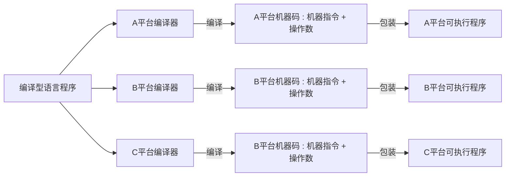
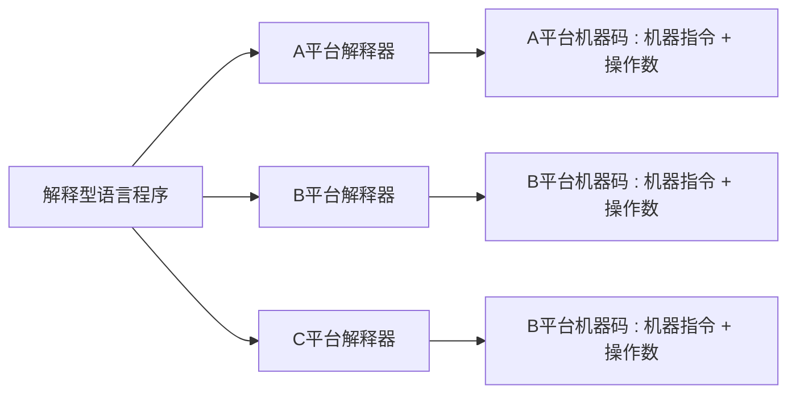
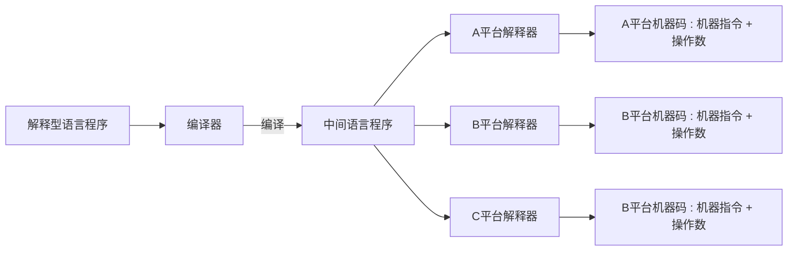

# JVM、JRE、JDK、SDK

## 1.JVM —— “write once, run anywhere”

​	按照程序的执行方式可以将编程语言划分为两类：编译型 和 解释型。

Java 是一种特殊的高级语言，它兼具了编译型语言和解释型语言的特性——Java程序既需要编译，也需要解释。

要点：

- Java 平台无关
- 一次编译 处处执行

## 2.JRE

## 3.JDK

## 4.SDK

## 5.关系

## 6.下载JDK