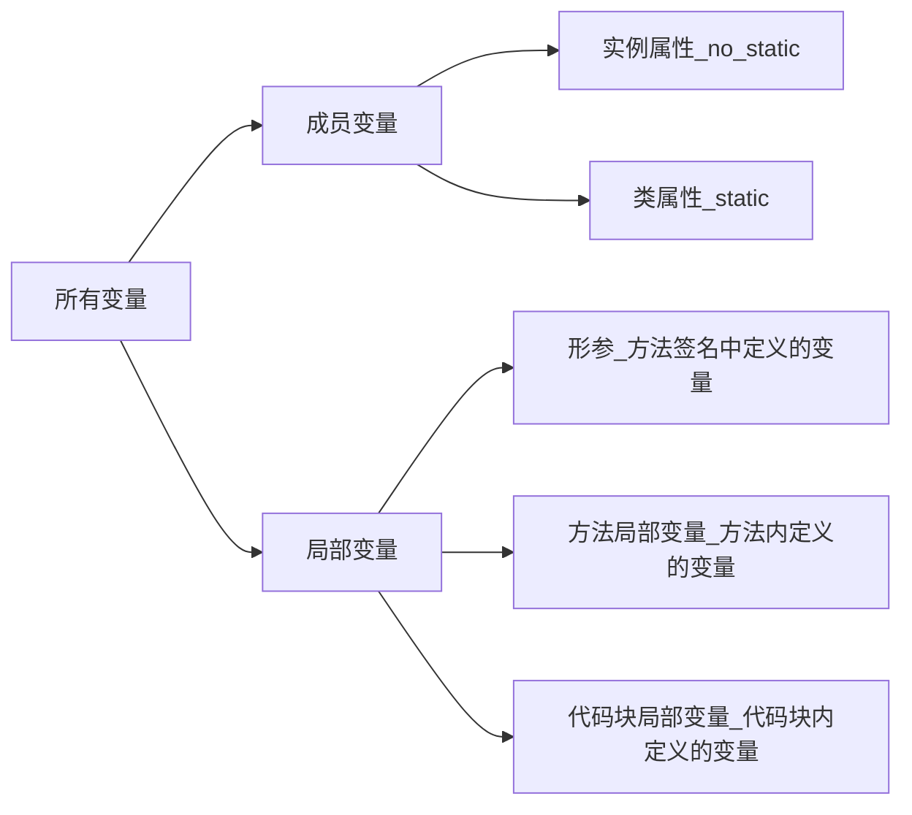

### 1. this 与 方法调用

同一个类中的一个方法调用另一个方法时，如果被调方法是普通方法，则默认使用this作为调用者；如果被调方法是类方法，则默认使用类作为调用者。

### 2.形参长度可变的方法

- 版本要求：JDK1.5及之后版本。
- 形参长度可变的参数其实就是一个数组参数，调用方法时可以传入一个数组。
- 与数组参数相比，形参长度可变的参数使方法的调用更加简洁。
- 形参长度可变的参数只能处于参数列表的最后，也就是说，一个方法中最多只能有一个长度可变的形参。

### 3.成员变量 与 局部变量

**系统会在类加载（准备阶段）或创建类的实例时为成员变量赋初始值。与成员变量不同，局部变量除了形参之外，都必须显式初始化。**