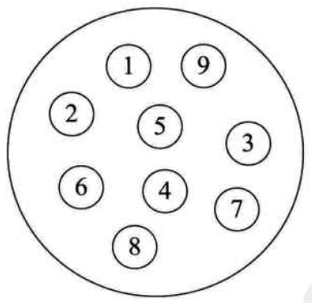
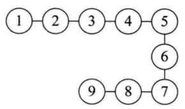
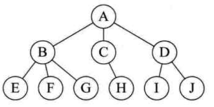
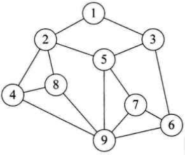
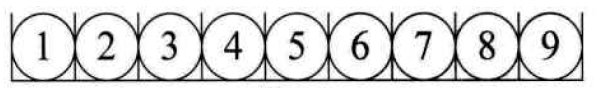
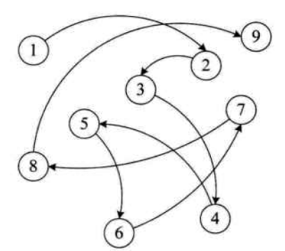
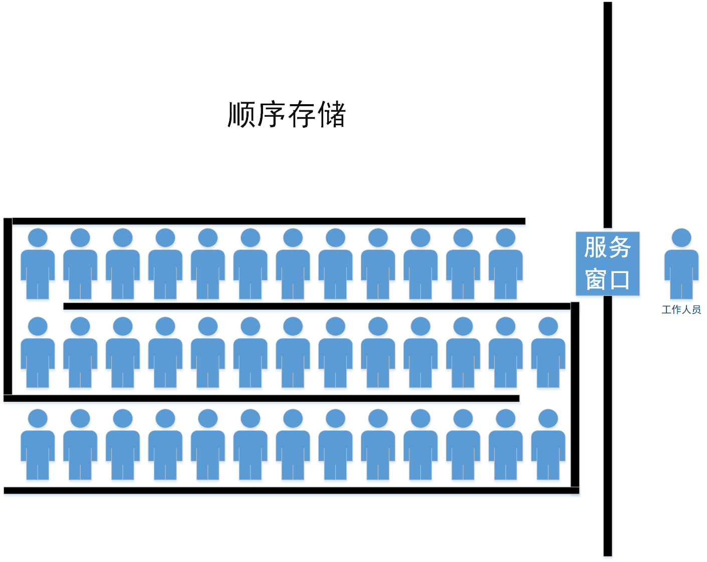
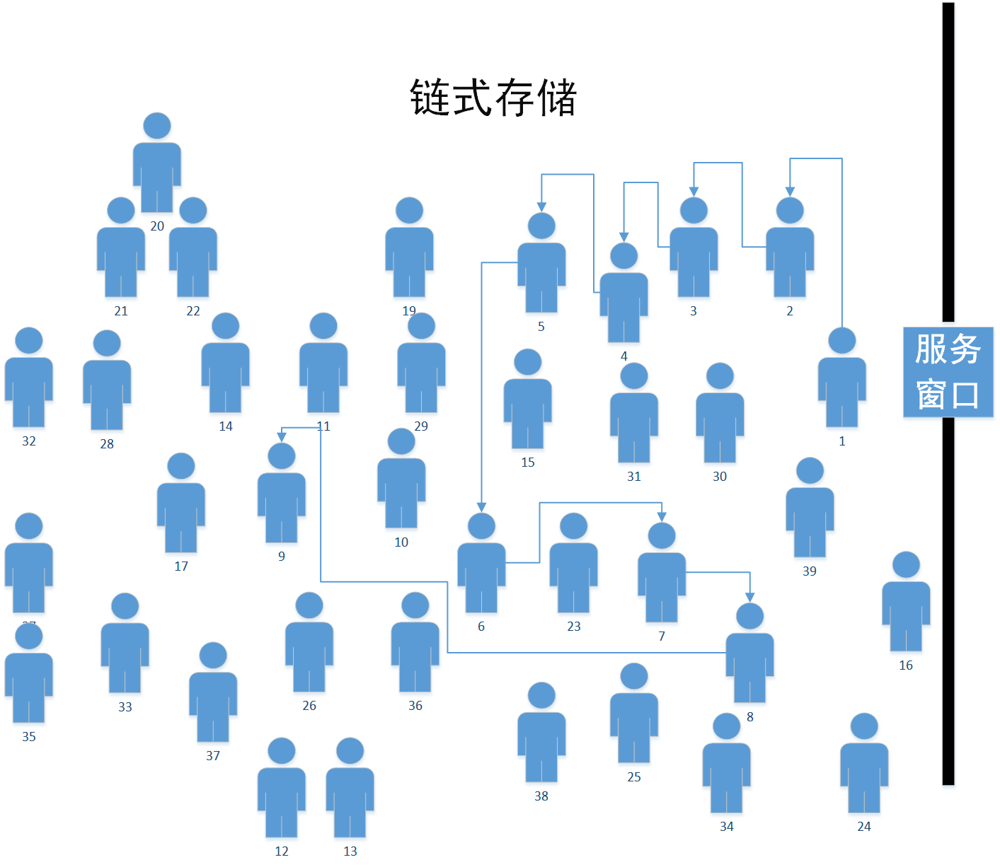

# 逻辑结构、物理结构

---

## 逻辑结构

逻辑结构是指数据对象和数据元素之间的相互关系。

>数据元素：组成数据的、有一定意义的基本单元。
>
>数据对象 ：性质相同的数据元素的结合，在不引起混淆时，简称“数据”。

逻辑结构分为以下4种：

### 1. 集合结构

集合结构中的数据元素除了同属一个集合，没有其他关系。集合结构是最“松散”的逻辑结构。

### 2. 线性结构

线性结构中的元素具有1对1关系：

### 3. 树形结构

树形结构中的元素具有1对n关系：

### 4. 图形结构

图形结构中的元素具有n对m关系：

## 物理结构

物理结构也称“存储结构”，指的是逻辑结构在计算机中的存储形式。

逻辑结构更加抽象，物理结构更加具体。一种数据结构可能可以使用多种物理结构实现。

数据元素的存储结构形式有两种：顺序存储、链式存储。

### 1.顺序存储存储

把数据存在在地址连续的存储单元里，其数据间的逻辑关系与物理关系是一致的。

### 2.链式存储存储

把数据元素存放在任务的存储单元里，即存储单元可以是连续的，也可以是不连续的。数据元素的存储关系并不能反应其逻辑关系。

计算机中，连续的空间是非常宝贵的，大段的连续空间更是稀缺，相较而言，链式存储更加灵活。

---

参考文献：《大话数据结构》

