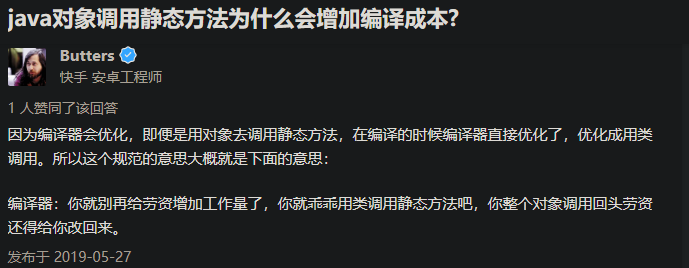

【强制】避免通过一个类的对象引用访问此类的静态变量或静态方法， 无谓增加编译器解析成本，直接用类名来访问即可。

---

1. 使用类名即可直接访问类的静态资源，创建对象将消耗不必要的系统资源。对象创建好以后，还是需要查找对象的定义类型才能访问类的静态资源，即使查找对象定义类型所付出的成本很低，但这种“脱裤子放屁”的行为也是十分不“优雅”的。

2. 部分编译器会对代码进行优化，在编译程序的时候将对象调用转换成类名调用，这部分优化的成本也是额外的、可以避免的。

    

    

