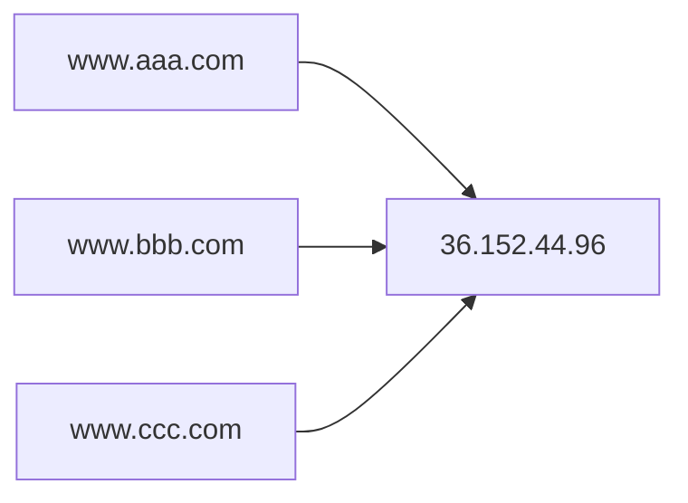

# DNS域名解析

### 1.URL、域名与IP地址

1. 互联网中的资源需要通过URL来进行发布和请求。
2. 在与远程主机建立连接之前，需要先将URL中的域名解析成对应的ip地址。
3. 相比ip地址，域名更容易记忆（36.152.44.96 <=> www.baidu.com）。
4. 域名与ip地址是多对一关系。多个域名可以映射到同一个ip地址，一个域名只能被映射到一个ip地址。

### 2.DNS域名解析

#### 2.1 DNS 域名解析过程

